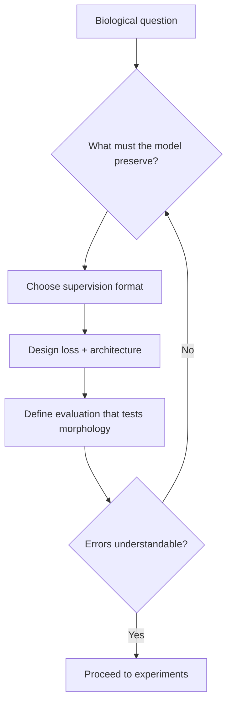

This is a development note from week one of ShadoNet. I am writing it in the middle of the project rather than after everything has been cleaned into a paper narrative, because the middle is where most of the useful decisions happen.

The main problem this week was choosing the supervision signal. That sounds narrow, but it touches almost every part of the project. In a sparse-supervision setting, the label is not just a label. It determines what the model is allowed to know, what the loss can reasonably ask for, and what the evaluation has to prove.

I keep returning to this: the label format is a hypothesis about what the model needs to learn, not a neutral input.

## The choice underneath the choice

The obvious version of the decision was technical. What input should the method expect? What targets should the loss use? What form should the output take? Those questions matter, but they are downstream of a more important one: what information is necessary for the model to learn the morphology I care about?

This week the central tension was that the signal needed to be cheap enough to collect, but still rich enough to force the model to look at nuclei rather than background texture. I do not want ShadoNet to be a method that succeeds because the supervision was made artificially easy. I also do not want it to require a label type that removes the practical motivation for the work.

<aside class="callout callout--key-idea" role="note">

Key idea

Annotation cost is a real constraint, but it should not be the only argument for sparse labels. The stronger claim is that the supervision format should match the biological question.

</aside>

The mistake I am trying to avoid is treating annotation cost as the only reason to use sparse labels. Dense nucleus masks are slow, difficult, and not always reproducible. But if the argument stops there, the method becomes a convenience method. I want the stronger argument articulated in [morphology before accuracy](/blog/research-notes/morphology-before-accuracy): label resolution and label relevance are different questions.

## What did not work cleanly

The most useful sentence in my notes this week is: I kept wanting the label to do more work than it honestly could.

That sentence is not a disaster. It is a warning. A project can become fragile when the early story is too smooth. If every design choice seems obvious, I probably have not looked closely enough. In ShadoNet, several choices look obvious only until I imagine the failure case. A model can detect nuclei without learning meaningful shape. It can produce neat maps that are not biologically informative. It can improve a metric while making the wrong errors less visible.

<aside class="callout callout--observation" role="note">

Observation

I spent an afternoon listing annotation types on a whiteboard—centers, bounding boxes, scribbles, full masks—and realized I was mixing <em>what is easy to collect</em> with <em>what the loss can enforce</em>. Those are related but not identical.

</aside>

I am trying to build the habit of asking what a bad but plausible solution would look like. Not a random failure, but a seductive failure. The kind of output that would be easy to include in a figure because it looks reasonable at first glance. Those are the failures that worry me most.

## The current decision

For now, the decision is to treat annotation as a design choice rather than a fixed input format. This may change. I am deliberately writing it as a current decision, not a final principle.

The practical consequence is that I need to make the project more explicit. It is not enough to say that the method uses sparse supervision, as I wrote in [what is weak supervision](/blog/small-explainers/what-is-weak-supervision). I need to say what the sparse signal implies, what it leaves unspecified, and how the model is encouraged to fill in the missing information. I also need to be honest about what it cannot support. If a task requires exact boundaries, then a method trained from sparse centers should not pretend to solve boundary measurement unless there is additional evidence.

<aside class="callout callout--misconception" role="note">

Common misconception

Sparse supervision is not automatically weak supervision in the methodological sense. A center point can be exactly the right signal if the biological question is about object existence and approximate spatial arrangement, not pixel boundaries.

</aside>

This is where morphology becomes more than a motivation. It becomes the constraint that keeps the project from drifting. If a design choice cannot be explained in terms of morphology, annotation realism, or evaluation, it probably does not belong in the core argument.

## Experiments as questions

I am trying to write experiments as questions instead of as leaderboard attempts. A good experiment for this stage should answer something like: does this supervision signal preserve object-level information? Does the method fail differently when nuclei overlap? Does it respond to stain variation in a way that suggests a shortcut?

These are not all easy to test. Some require qualitative inspection. Some require synthetic or controlled cases. Some require comparing error types rather than only comparing scores. But I think the project will be stronger if these questions shape the experiments early.

The next concrete step—before I touch architecture details—is to write down exactly what each annotation type can and cannot support. That is a small step, but it is the kind of small step that prevents a project from becoming vague. [Week 2](/blog/building-shadonet/week-2-center-annotations-vs-segmentation-masks) will be where I compare center annotations with dense masks in earnest.

## Open question for next week

Before the project grows more complicated, I want one deliberately small check attached to this decision: a few controlled examples, a clear expected behavior, and a visual inspection step that is not allowed to be replaced by a summary metric. The purpose is not to prove the method. The purpose is to catch contradictions between the story I am telling and the behavior the model actually shows.

I still do not know how to formalize "the label is doing enough work" without leaning on dense ground truth I do not have. That gap is exactly what week two needs to address.
