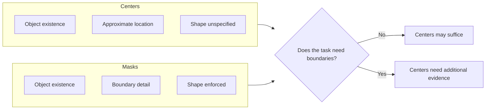

This is a development note from week two of ShadoNet, following [week 1's decision](/blog/building-shadonet/week-1-choosing-the-supervision-signal) to treat supervision as a design choice. The main problem this week was comparing center annotations with segmentation masks—not as a leaderboard comparison, but as a question about what each signal actually commits the model to learning.

## The choice underneath the choice

Center points preserve object existence. Masks preserve boundary detail. The project cannot pretend those are the same signal, even when both are applied to the same nuclei.

My early notes mixed detection, counting, and segmentation language too freely. That ambiguity showed up later in the loss function.

I re-read my own explainer on [center points vs. segmentation masks](/blog/small-explainers/center-points-vs-segmentation-masks) and noticed something uncomfortable: I had written it as if the tradeoff were mostly about annotation cost. For ShadoNet, cost matters, but the deeper question is whether center supervision can still create pressure toward morphology-aware representations. A center tells you *where* a nucleus is. It does not tell you *what shape* it has. Whether that omission is acceptable depends entirely on the biological claim.

<aside class="callout callout--key-idea" role="note">

Key idea

Center annotations should be treated as a serious supervision format, not as a degraded mask. The model must infer shape from context—and that inference needs to be evaluated, not assumed.

</aside>

## What did not work cleanly

I tried sketching a side-by-side comparison table early in the week and realized I was comparing things at the wrong level of abstraction. "Center vs. mask" is not one decision. It is at least three: what the annotator marks, what the loss penalizes, and what the evaluation measures. I had been collapsing all three into a single column labeled "supervision type."

<aside class="callout callout--observation" role="note">

Observation

When I looked at overlapping nuclei in a few patches, center annotations felt clean and masks felt ambiguous. The annotator disagreement I worry about with masks does not disappear with centers—it just moves to a different part of the pipeline.

</aside>

The most useful sentence in my notes this week is: my early notes mixed detection, counting, and segmentation language too freely. That slippage would have made the paper impossible to evaluate. A reader needs to know whether ShadoNet is claiming detection, approximate segmentation, or something in between.

I also spent time with [why pixel-perfect labels aren't always necessary](/blog/research-notes/why-pixel-perfect-labels-arent-always-necessary). That note helped, but it did not resolve the ShadoNet-specific question: if I train from centers, what morphology am I allowed to claim the model learned?

## The current decision

For now, the decision is to use center annotations as the primary supervision format and to be explicit about what that format leaves open. This may change. I am deliberately writing it as a current decision, not a final principle.

The practical consequences:

- The loss cannot pretend it has boundary information it does not have.
- Evaluation must include slices where center-only supervision succeeds or fails visibly—overlap regions, partial nuclei at tile edges, stain variation.
- Any morphology claim needs qualitative evidence, not only a detection metric.

<aside class="callout callout--misconception" role="note">

Common misconception

Training with centers and evaluating with mask IoU is not a fair test of whether center supervision works. It tests whether the model guessed boundaries you never supervised.

</aside>

## What I tried and set aside

I considered a hybrid approach: centers for training, masks available on a small validation subset. That sounds reasonable until you ask what the validation subset is actually validating. If masks exist only on a subset, they cannot define the training objective—they can only audit it. I have not yet built that audit set, and I am resisting the temptation to treat a future audit as evidence I already have.

## Open question for next week

The next concrete step is to define evaluation slices where the difference between center and mask supervision becomes visible. Before running anything large, I want a short list of patch types—dense overlap, edge truncation, stain outliers—and a written prediction for how a center-supervised model should behave on each.

I still do not know whether the first training runs will fail because the objective is wrong or because I have not made the expected failure modes explicit. That uncertainty is what [week 3](/blog/building-shadonet/week-3-the-first-failed-experiments) is for.
