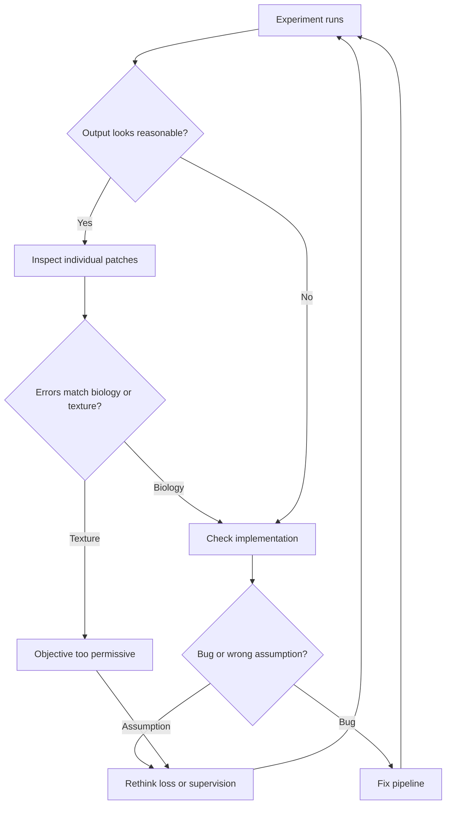

This is a development note from week three of ShadoNet. After [week 2](/blog/building-shadonet/week-2-center-annotations-vs-segmentation-masks) settled the annotation question—at least for now—I ran the first training experiments. They failed in a way that was more informative than success would have been, which is the polite way researchers say the plots looked fine and the biology did not.

## The failure I did not predict

The model produced plausible-looking outputs. Detection scores moved in the right direction. Visual inspection told a different story: responses clustered on stain intensity and tissue texture rather than on nucleus boundaries I cared about.

I had not made the expected failure modes explicit before running the experiment. That omission cost me two days of debugging the wrong layer.

The most useful sentence in my notes this week is exactly that: I had not written down what "seductive failure" would look like before I saw it on screen. I was looking for crashes and NaNs. I found organized wrongness instead.

<aside class="callout callout--observation" role="note">

Observation

Aggregate loss curves looked healthy. Individual patches revealed the model attending to eosinophilic regions that correlated with nucleus density but were not nucleus-shaped. The metric and the morphology diverged quietly.

</aside>

This connects to [what makes weak supervision difficult](/blog/research-notes/what-makes-weak-supervision-difficult): when the label under-specifies the target, the model has freedom to satisfy the loss through shortcuts you did not name.

## Sorting failure types

I spent the second half of the week trying to classify what went wrong. Three categories emerged:

1. **Implementation bugs** — coordinate offsets, label normalization, train/val leakage across tiles from the same slide. I found one off-by-one issue in the center-target mapping. Fixing it changed numbers slightly but did not fix the texture shortcut.
2. **Weak objectives** — the loss rewarded presence near center points without penalizing shapeless blobs. This felt like the main story.
3. **Wrong assumptions** — I had assumed center supervision would automatically discourage background texture because nuclei are visually distinct. That assumption was too optimistic.

<aside class="callout callout--key-idea" role="note">

Key idea

A failed experiment is most useful when it preserves information about what was actually tested. I started logging not only hyperparameters but the <em>claim</em> each run was supposed to support.

</aside>

## What I did not do

I did not declare the project broken. I also did not rescue the run by tuning learning rate for three more days. Both responses would have hidden the diagnostic value of the failure.

I did not yet have mask-based ground truth on enough patches to quantify boundary error—and I am not going to invent numbers here. What I have is qualitative evidence that the current objective accepts solutions I do not want.

<aside class="callout callout--research-question" role="note">

Research question

Can a center-supervised objective reject texture shortcuts without dense boundary labels? I do not know yet. Week 3 narrowed the question; it did not answer it.

</aside>

## Open question for next week

The next step is not a bigger dataset. It is a clearer loss—one that makes the seductive failure harder to achieve. [Week 4](/blog/building-shadonet/week-4-rethinking-the-loss-function) will be about rethinking the objective, but before I rewrite code I want three hand-designed sanity cases: a single isolated nucleus, a dense overlap region, and a patch where stain intensity correlates with but does not define nucleus location.

I still do not know whether the texture shortcut is a property of my architecture, my augmentation pipeline, or the loss alone. Separating those is the experiment I have not run yet.
