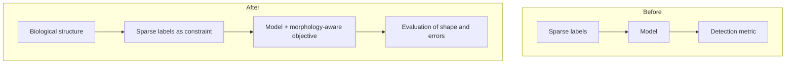

By week five of ShadoNet, the project had a naming problem. I was describing it as a sparse-supervision method. That was accurate but incomplete. Sparse supervision explained the annotation constraint; it did not explain what the model should preserve about the tissue. After [week 4's loss revisions](/blog/building-shadonet/week-4-rethinking-the-loss-function) and the failures in [week 3](/blog/building-shadonet/week-3-the-first-failed-experiments), morphology stopped being background motivation and became the organizing principle.

## Describing the project by the wrong handle

The most useful sentence in my notes this week: I was describing the project by the label format instead of by the biological structure it should learn.

"Sparse supervision" tells you what I don't have. Morphology tells you what I'm trying not to lose.

That reframing changed how I read my own earlier notes. [Week 1](/blog/building-shadonet/week-1-choosing-the-supervision-signal) asked what supervision signal to use. [Week 2](/blog/building-shadonet/week-2-center-annotations-vs-segmentation-masks) compared centers and masks. Those were necessary questions, but they framed the project from the annotator's perspective. The better frame is from the pathologist's: which visual structures must survive compression into a model, and which can be inferred?

<aside class="callout callout--key-idea" role="note">

Key idea

Sparse supervision alone is not a scientific contribution. Morphology-aware learning under sparse supervision is a claim about what representations should preserve when boundaries are unavailable.

</aside>

This aligns with [morphology before accuracy](/blog/research-notes/morphology-before-accuracy), but ShadoNet forces a harder version of the argument: I cannot lean on dense masks to verify every morphology claim. I need evaluation that surfaces shape-level failures without pretending I have pixel-perfect ground truth everywhere.

## What morphology means in this project

I am not using "morphology" as a vague synonym for "looks good under a microscope." In ShadoNet, it refers to a specific set of properties I want the representation to respect:

- approximate nucleus extent and orientation where centers are provided
- separation of touching or overlapping nuclei where the tissue demands it
- invariance to stain intensity without invariance to nuclear shape
- failure modes that a pathologist would recognize as wrong, not only low IoU

<aside class="callout callout--observation" role="note">

Observation

When I rewrote the project statement around morphology, several architecture choices looked ornamental. If a component could not be tied to a morphology failure mode, it moved to an appendix in my notes—or out entirely.

</aside>

That pruning felt uncomfortable. Complexity is reassuring when you are uncertain. Morphology as a filter is less reassuring but more honest.

## What I am not claiming

I am not claiming ShadoNet recovers full segmentation from centers alone. I am not claiming equivalence to mask-supervised methods on boundary metrics I did not train for. I am claiming—still tentatively—that center supervision plus a morphology-aware objective can produce representations useful for nucleus-centered analysis without dense annotation.

Whether that claim survives contact with data is an open question, not a conclusion.

<aside class="callout callout--research-question" role="note">

Research question

Which morphology properties are <em>identifiable</em> from center supervision, and which require boundaries or additional weak signals? I have a list of candidates; I do not have a proof.

</aside>

Reading [DINO and representation learning before labels](/blog/paper-notes/dino-representation-learning-can-expose-structure-before-labels-arrive) helped me separate two ideas: structure can emerge without dense labels, but emergence is not the same as the structure you need for a specific clinical question. ShadoNet needs the second, narrower claim.

## Open question for next week

The next step is to rewrite the experiment plan so every run tests a morphology hypothesis, not only a metric delta. Before scaling up, I want a table mapping: morphology property → patch type where it matters → what failure would look like → what I will inspect.

I still do not know how to evaluate morphology systematically without a small mask audit set I have not finished curating. [Week 6](/blog/building-shadonet/week-6-lessons-from-debugging) is where debugging the pipeline forced me to separate validation from hypothesis testing—and that separation may matter as much as the morphology framing itself.
