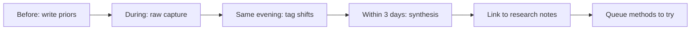

This is my template for writing CVPR notes. I do not want conference notes to become a travel diary or a list of talks I attended. I want them to become a record of what changed in my thinking.

The useful unit is not a talk summary — it is a changed question. If I cannot name what shifted, the note is not done yet.

The theme I will pay attention to at CVPR: computer vision methods, foundation models, representation learning, and what can or cannot transfer cleanly into pathology.

## How I use this notebook

Conferences produce noise faster than insight. This workflow keeps the signal:

<aside class="callout callout--observation" role="note">

Observation

Use callouts for ideas you want to find later. Replace this text with a one-sentence insight — e.g., "Most foundation-model papers still evaluate on ImageNet-style benchmarks that hide domain shift."

</aside>

## Before the conference

What am I hoping to learn?

- [Replace with 3–5 questions you are carrying into the conference.]
- [Add one question about computational pathology — e.g., do vision foundation models preserve morphology that matters for nuclei?]
- [Add one question about evaluation or annotation.]
- [Add one question about a method you are skeptical of but curious about.]

The point of this section is to make my priors visible. If I write down my questions beforehand, I can tell the difference between a talk that was polished and a talk that actually changed my map.

## Talks that shifted something

### Talk 1: [title / speaker]

What I expected:

[Placeholder.]

What surprised me:

[Placeholder.]

The idea I want to keep:

[Placeholder.]

### Talk 2: [title / speaker]

What I expected:

[Placeholder.]

What surprised me:

[Placeholder.]

The idea I want to keep:

[Placeholder.]

I want this section to be selective. A useful note explains *why* a talk mattered — not that it was "inspiring."

## Papers that changed thinking

I link to my [paper notes](/blog/paper-notes/dino-representation-learning-can-expose-structure-before-labels-arrive) when a talk reminds me of something I already read — the conference note should say what changed, not repeat the summary.

For each paper (talk, poster, or preprint mentioned on stage), record the shift:

1. **[Paper title / arXiv ID]** — Before I thought: [placeholder]. After CVPR I think: [placeholder]. Worth a full read? [yes / maybe / no]
2. **[Paper title]** — The assumption it challenged: [placeholder]
3. **[Paper title]** — Connection to my work: [placeholder — e.g., relates to [morphology before accuracy](/blog/research-notes/morphology-before-accuracy)]

Papers I queued but did not read yet:

- [Placeholder]
- [Placeholder]

## Open questions surfaced

Questions that became sharper at CVPR:

1. [Placeholder — e.g., can self-supervised pretraining on natural images preserve nucleus boundary structure?]
2. [Placeholder — e.g., are patch-level benchmarks hiding whole-slide failure modes?]
3. [Placeholder]

<aside class="callout callout--research-question" role="note">

Research question

Replace with a question specific enough to design an experiment — not "how do foundation models work?" but "does DINO-style pretraining improve center-point detection under 5% labeled data?"

</aside>

## Methods to try

Methods or baselines worth testing after CVPR:

| Method / idea | Why it might matter | Effort | Priority |
|---|---|---|---|
| [e.g., masked image modeling on patches] | [placeholder] | [low / med / high] | [now / later / maybe] |
| [placeholder] | [placeholder] | [placeholder] | [placeholder] |
| [placeholder] | [placeholder] | [placeholder] | [placeholder] |

Concrete next step for the top item: [placeholder — e.g., reproduce baseline on my nucleus dataset with center-only labels]

## Conversations worth remembering

Not networking performance — conversations that helped me think:

- **[Name / affiliation]** — Topic: [placeholder]. The sentence I want to keep: "[placeholder]" — Follow-up: [email / read their paper / none]
- **[Name]** — They pushed back on: [placeholder]. I still disagree because: [placeholder / or: they were right about…]
- **[Name]** — Hallway detail that did not make the talk: [placeholder — e.g., their baseline only worked after fixing stain normalization]

## Failure modes noticed

Patterns of failure I heard about or recognized in my own thinking:

- **[Failure mode]** — Where I saw it: [talk / poster / my project]. Why it matters: [placeholder]
- **[e.g., evaluation on easy patches only]** — [placeholder]
- **[e.g., augmentations that destroy morphology]** — [placeholder]

<aside class="callout callout--failure" role="note">

Failure story

Replace with a failure you noticed at the conference or in your own work — e.g., "Three papers claimed SOTA but none reported performance on clustered nuclei."

</aside>

## Posters worth returning to

Poster sessions hide the decisions that matter: sampling, baselines, honest negative results.

1. **[Poster title]** — Decision worth remembering: [placeholder]
2. **[Poster title]** — Decision worth remembering: [placeholder]
3. **[Poster title]** — Decision worth remembering: [placeholder]

## Patterns I noticed

Field-level motion at CVPR this year:

- Are foundation models being evaluated as representations, products, or scientific instruments?
- Are weakly supervised methods honest about localization uncertainty?
- Are biomedical transfer papers describing enough provenance to judge generalization?
- Are negative results visible, or only implied by what people avoided discussing?

[Write 3–6 paragraphs here after the conference.]

## What this changes for my own work

After CVPR, I want to ask:

- Which idea should I read more deeply?
- Which method should I test or adapt carefully?
- Which assumption in [ShadoNet](/blog/building-shadonet/week-5-why-morphology-became-the-central-idea) feels weaker now?
- Which result made me more or less confident that my research question matters?

[Write the answer as prose, not a checklist.]

## After-conference synthesis

Within a few days, answer three questions:

**What idea followed me home?** [One idea, not a list.]

**What assumption became weaker?** [Placeholder — link to a [research note](/blog/research-notes/foundation-models-are-powerful-but-not-magic) if relevant.]

**What should I do next?** [Read / reproduce / email / redesign experiment / write a short note.]

## What not to write

I should not write that a talk was "inspiring" without saying what shifted. The useful unit is a changed question.

A good final paragraph should say: before CVPR, I thought one thing; after it, I am less certain, more precise, or newly curious about another thing.

[Placeholder for that sentence.]
