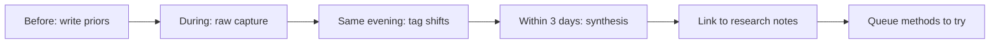

This is my template for writing MICCAI notes. I do not want conference notes to become a travel diary or a list of talks I attended. I want them to become a record of what changed in my thinking.

MICCAI sits at the gap between algorithmic elegance and biomedical constraints. My notes should name that gap, not smooth it over.

The theme I will pay attention to at MICCAI: medical image computing, clinical translation, segmentation, uncertainty, and the distance between a benchmark result and a useful instrument.

## How I use this notebook

<aside class="callout callout--observation" role="note">

Observation

Replace with a MICCAI-specific observation — e.g., "The most convincing papers named what clinicians would ignore even if the Dice score improved."

</aside>

## Before the conference

What am I hoping to learn?

- [Replace with 3–5 questions you are carrying into the conference.]
- [Add one question about computational pathology — e.g., do histopathology papers face different annotation economics than radiology?]
- [Add one question about evaluation or annotation.]
- [Add one question about a method you are skeptical of but curious about.]

The point of this section is to make my priors visible before the conference noise arrives.

## Talks that shifted something

### Talk 1: [title / speaker]

What I expected:

[Placeholder.]

What surprised me:

[Placeholder.]

The idea I want to keep:

[Placeholder.]

### Talk 2: [title / speaker]

What I expected:

[Placeholder.]

What surprised me:

[Placeholder.]

The idea I want to keep:

[Placeholder.]

## Papers that changed thinking

1. **[Paper title]** — Before I thought: [placeholder]. After MICCAI I think: [placeholder]. Worth a full read? [yes / maybe / no]
2. **[Paper title]** — The clinical or biological assumption it tested: [placeholder]
3. **[Paper title]** — Connection to my work: [placeholder — e.g., relates to [what makes a medical AI paper convincing](/blog/research-notes/what-makes-a-medical-ai-paper-convincing)]

Papers I queued but did not read yet:

- [Placeholder]
- [Placeholder]

## Open questions surfaced

1. [Placeholder — e.g., when is external validation actually informative vs. ceremonial?]
2. [Placeholder — e.g., do attention maps in MIL papers correlate with anything pathologists trust?]
3. [Placeholder]

<aside class="callout callout--research-question" role="note">

Research question

Replace with a question grounded in biomedical constraints — e.g., "Would a 2% Dice improvement change any real annotation workflow on my dataset?"

</aside>

## Methods to try

| Method / idea | Why it might matter | Effort | Priority |
|---|---|---|---|
| [e.g., multi-site stain normalization] | [placeholder] | [low / med / high] | [now / later / maybe] |
| [placeholder] | [placeholder] | [placeholder] | [placeholder] |
| [placeholder] | [placeholder] | [placeholder] | [placeholder] |

Concrete next step for the top item: [placeholder]

## Conversations worth remembering

- **[Name / affiliation]** — Topic: [placeholder]. The sentence I want to keep: "[placeholder]" — Follow-up: [placeholder]
- **[Clinician / pathologist / engineer]** — What they cared about that the paper did not emphasize: [placeholder]
- **[Name]** — Hallway detail: [placeholder — e.g., IRB constraints shaped their train/test split more than methodology]

The best MICCAI conversations often come from people who live with the data daily, not only the people who trained the model.

## Failure modes noticed

- **[Failure mode]** — Where I saw it: [talk / poster / my project]. Why it matters: [placeholder]
- **[e.g., single-center evaluation presented as generalization]** — [placeholder]
- **[e.g., segmentation metrics on artifacts, not biology]** — [placeholder]

<aside class="callout callout--failure" role="note">

Failure story

Replace with a failure pattern — e.g., "A method failed silently on overlapping nuclei, but the paper only reported aggregate F1."

</aside>

## Posters worth returning to

1. **[Poster title]** — Decision worth remembering: [placeholder — dataset provenance, endpoint definition, failure visualization]
2. **[Poster title]** — Decision worth remembering: [placeholder]
3. **[Poster title]** — Decision worth remembering: [placeholder]

## Patterns I noticed

Field-level motion at MICCAI this year:

- Are papers describing dataset cost and annotation provenance honestly? (See [the hidden cost of biomedical datasets](/blog/research-notes/the-hidden-cost-of-biomedical-datasets).)
- Are weakly supervised methods honest about localization uncertainty?
- Is attention being sold as explanation? (See [attention as an interface](/blog/paper-notes/attention-based-deep-mil-attention-as-an-interface-not-an-explanation).)
- Are negative results visible, or only implied?

[Write 3–6 paragraphs here after the conference.]

## What this changes for my own work

After MICCAI, I want to ask:

- Which idea should I read more deeply?
- Which method should I test with my annotation budget in mind?
- Which assumption in my own project feels weaker now?
- Which result made me more confident that my research question matters?

[Write the answer as prose, not a checklist.]

## After-conference synthesis

**What idea followed me home?** [One idea, not a list.]

**What assumption became weaker?** [Placeholder.]

**What should I do next?** [Read / reproduce / email / redesign experiment / write a short note.]

## What not to write

I should not write that a talk was "clinically relevant" without saying what decision it would change.

[Placeholder: before MICCAI I thought…; after it…]
