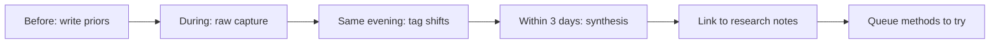

This is my template for writing MIDL notes. I do not want conference notes to become a travel diary or a list of talks I attended. I want them to become a record of what changed in my thinking.

MIDL is smaller and more method-focused than MICCAI. That makes it a good place to catch assumptions before they become field defaults.

The theme I will pay attention to at MIDL: medical imaging research at the boundary between machine learning methods and clinical or biological questions — especially histopathology, weak supervision, and representation learning.

## How I use this notebook

<aside class="callout callout--paper-insight" role="note">

Paper insight

Replace with an insight from a MIDL paper — e.g., "Multi-scale hierarchy in histology is not just an architecture choice; it reflects how pathologists actually scan a slide."

</aside>

## Before the conference

What am I hoping to learn?

- [Replace with 3–5 questions you are carrying into the conference.]
- [Add one question about computational pathology — e.g., does [pathology being different from natural images](/blog/research-notes/why-pathology-is-different-from-natural-images) change which SSL methods transfer?]
- [Add one question about evaluation or annotation.]
- [Add one question about a method you are skeptical of but curious about.]

The point of this section is to make my priors visible.

## Talks that shifted something

### Talk 1: [title / speaker]

What I expected:

[Placeholder.]

What surprised me:

[Placeholder.]

The idea I want to keep:

[Placeholder.]

### Talk 2: [title / speaker]

What I expected:

[Placeholder.]

What surprised me:

[Placeholder.]

The idea I want to keep:

[Placeholder.]

## Papers that changed thinking

1. **[Paper title]** — Before I thought: [placeholder]. After MIDL I think: [placeholder]. Worth a full read? [yes / maybe / no]
2. **[Paper title]** — The supervision assumption it made explicit: [placeholder]
3. **[Paper title]** — Connection to my work: [placeholder — e.g., relates to [choosing the supervision signal](/blog/building-shadonet/week-1-choosing-the-supervision-signal)]

Papers I queued but did not read yet:

- [Placeholder]
- [Placeholder]

## Open questions surfaced

1. [Placeholder — e.g., when does patch-level pretraining help slide-level tasks?]
2. [Placeholder — e.g., is multi-scale hierarchy necessary or just convenient? See [HIPT notes](/blog/paper-notes/hipt-histology-has-a-natural-scale-hierarchy).]
3. [Placeholder]

<aside class="callout callout--research-question" role="note">

Research question

Replace with a pathology-specific question — e.g., "Does center-point supervision preserve enough morphology for downstream classification, or only for detection?"

</aside>

## Methods to try

| Method / idea | Why it might matter | Effort | Priority |
|---|---|---|---|
| [e.g., hierarchical patch encoding] | [placeholder] | [low / med / high] | [now / later / maybe] |
| [placeholder] | [placeholder] | [placeholder] | [placeholder] |
| [placeholder] | [placeholder] | [placeholder] | [placeholder] |

Concrete next step for the top item: [placeholder]

## Conversations worth remembering

- **[Name / affiliation]** — Topic: [placeholder]. The sentence I want to keep: "[placeholder]" — Follow-up: [placeholder]
- **[Name]** — They changed my mind about: [placeholder]
- **[Name]** — Hallway detail: [placeholder — e.g., their weak labels came from a different annotator agreement threshold than mine]

At MIDL I ask: "What would you have done differently with twice the annotation budget?" and "What would you have done with half?"

## Failure modes noticed

- **[Failure mode]** — Where I saw it: [talk / poster / my project]. Why it matters: [placeholder]
- **[e.g., stain batch effects treated as noise]** — [placeholder]
- **[e.g., MIL aggregation hiding patch-level failures]** — [placeholder]

<aside class="callout callout--lesson" role="note">

Lesson learned

Replace with a lesson — e.g., "A method that works on TCGA patches may fail on my scanner without anyone calling it domain shift."

</aside>

## Posters worth returning to

1. **[Poster title]** — Decision worth remembering: [placeholder]
2. **[Poster title]** — Decision worth remembering: [placeholder]
3. **[Poster title]** — Decision worth remembering: [placeholder]

## Patterns I noticed

Field-level motion at MIDL this year:

- Are pathology foundation models being evaluated as representations or products?
- Are weakly supervised methods honest about what the label actually supervises?
- Are scale hierarchies being used because they match biology or because they match GPU memory?
- Are negative results visible?

[Write 3–6 paragraphs here after the conference.]

## What this changes for my own work

After MIDL, I want to ask:

- Which idea should I read more deeply?
- Which method should I test on my nucleus dataset?
- Which assumption in ShadoNet feels weaker now?
- Which result made me more confident that morphology-aware learning matters?

[Write the answer as prose, not a checklist.]

## After-conference synthesis

**What idea followed me home?** [One idea, not a list.]

**What assumption became weaker?** [Placeholder.]

**What should I do next?** [Read / reproduce / email / redesign experiment / write a short note.]

## What not to write

I should not write that a method "works on histopathology" without naming the dataset, stain, magnification, and label type.

[Placeholder: before MIDL I thought…; after it…]
