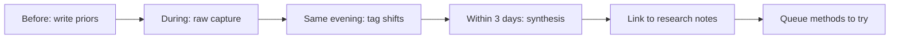

This is my template for writing NeurIPS notes. I do not want conference notes to become a travel diary or a list of talks I attended. I want them to become a record of what changed in my thinking.

NeurIPS rewards clean theory and clever benchmarks. My job in these notes is to ask which results survive contact with messy biomedical data.

The theme I will pay attention to at NeurIPS: machine learning ideas, evaluation culture, data-centric AI, uncertainty, and the assumptions behind learning systems.

## How I use this notebook

<aside class="callout callout--key-idea" role="note">

Key idea

Callouts mark ideas worth retrieving later. Replace this with something like: "A benchmark can be 'solved' while the underlying scientific question remains open."

</aside>

## Before the conference

What am I hoping to learn?

- [Replace with 3–5 questions you are carrying into the conference.]
- [Add one question about computational pathology — e.g., do MIL assumptions hold when labels are slide-level but errors are patch-level?]
- [Add one question about evaluation or annotation.]
- [Add one question about a method you are skeptical of but curious about.]

The point of this section is to make my priors visible. Conferences are overwhelming because every talk sounds important while it is happening.

## Talks that shifted something

### Talk 1: [title / speaker]

What I expected:

[Placeholder.]

What surprised me:

[Placeholder.]

The idea I want to keep:

[Placeholder.]

### Talk 2: [title / speaker]

What I expected:

[Placeholder.]

What surprised me:

[Placeholder.]

The idea I want to keep:

[Placeholder.]

## Papers that changed thinking

1. **[Paper title / arXiv ID]** — Before I thought: [placeholder]. After NeurIPS I think: [placeholder]. Worth a full read? [yes / maybe / no]
2. **[Paper title]** — The assumption it challenged: [placeholder]
3. **[Paper title]** — Connection to my work: [placeholder — e.g., relates to [why evaluation matters](/blog/research-notes/why-evaluation-matters-more-than-another-1-accuracy)]

Papers I queued but did not read yet:

- [Placeholder]
- [Placeholder]

## Open questions surfaced

Questions that became sharper at NeurIPS:

1. [Placeholder — e.g., when does weak supervision actually hurt calibration?]
2. [Placeholder — e.g., are we measuring epistemic or aleatoric uncertainty in pathology tasks?]
3. [Placeholder]

A good open question should be falsifiable. "Is uncertainty important?" is too soft. "Does CLAM-style attention correlate with pathologist disagreement?" is better.

<aside class="callout callout--research-question" role="note">

Research question

Replace with a question you could turn into an ablation — e.g., "Does adding an uncertainty head change F1 on imbalanced nucleus classes, or only the confidence plots?"

</aside>

## Methods to try

| Method / idea | Why it might matter | Effort | Priority |
|---|---|---|---|
| [e.g., conformal prediction for patch scores] | [placeholder] | [low / med / high] | [now / later / maybe] |
| [placeholder] | [placeholder] | [placeholder] | [placeholder] |
| [placeholder] | [placeholder] | [placeholder] | [placeholder] |

Concrete next step for the top item: [placeholder]

## Conversations worth remembering

- **[Name / affiliation]** — Topic: [placeholder]. The sentence I want to keep: "[placeholder]" — Follow-up: [placeholder]
- **[Name]** — They pushed back on: [placeholder]. My response now: [placeholder]
- **[Name]** — Hallway detail: [placeholder — e.g., their "simple baseline" took three months to tune]

## Failure modes noticed

- **[Failure mode]** — Where I saw it: [talk / poster / my project]. Why it matters: [placeholder]
- **[e.g., leaderboard overfitting]** — [placeholder]
- **[e.g., reporting mean metrics on heavy-tailed error distributions]** — [placeholder]

<aside class="callout callout--misconception" role="note">

Common misconception

Replace with a misconception you heard repeated — e.g., "Higher validation AUC automatically means the model learned biology, not shortcuts."

</aside>

## Posters worth returning to

1. **[Poster title]** — Decision worth remembering: [placeholder]
2. **[Poster title]** — Decision worth remembering: [placeholder]
3. **[Poster title]** — Decision worth remembering: [placeholder]

## Patterns I noticed

Field-level motion at NeurIPS this year:

- Is "data-centric AI" changing experimental practice or mostly changing language?
- Are uncertainty methods being evaluated on tasks where uncertainty actually changes decisions?
- Are negative results visible, or only implied by what people avoided discussing?
- Are biomedical papers borrowing ML methods without borrowing ML skepticism?

[Write 3–6 paragraphs here after the conference.]

## What this changes for my own work

After NeurIPS, I want to ask:

- Which idea should I read more deeply? (See [how I read a paper](/blog/small-explainers/how-i-read-a-research-paper) for my process.)
- Which method should I test or adapt carefully?
- Which assumption in my evaluation plan feels weaker now?
- Which result made me more or less confident about [weak supervision with admitted uncertainty](/blog/paper-notes/clam-weak-supervision-works-best-when-it-admits-its-own-uncertainty)?

[Write the answer as prose, not a checklist.]

## After-conference synthesis

**What idea followed me home?** [One idea, not a list.]

**What assumption became weaker?** [Placeholder.]

**What should I do next?** [Read / reproduce / email / redesign experiment / write a short note.]

## What not to write

I should not write that a talk was "inspiring" without saying what shifted. The useful unit is a changed question.

[Placeholder: before NeurIPS I thought…; after it…]
