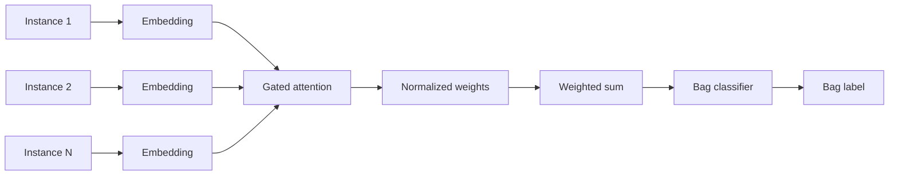
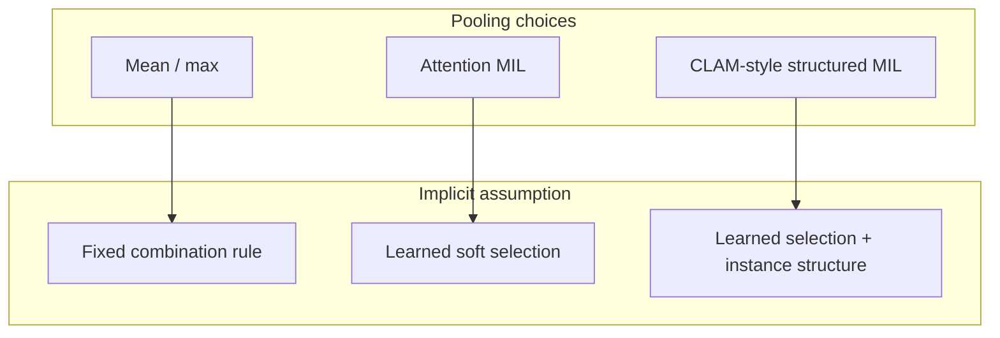

Reference: [Attention-based Deep Multiple Instance Learning](https://proceedings.mlr.press/v80/ilse18a.html). Maximilian Ilse, Jakub M. Tomczak, and Max Welling. ICML 2018.

This is not a summary of Ilse et al. What stayed with me is this: **attention-based MIL gives you a trainable interface between instance features and bag labels—it does not give you a free explanation of pathology.**

## The mechanism, briefly

In standard MIL, a bag label is positive if at least one instance is positive (for binary classification). Ilse et al. replace fixed pooling with **learned attention weights**:

- each instance embedding gets a score via a small neural network (gated attention uses both tanh and sigmoid branches)
- weights are normalized (softmax) across instances
- the bag representation is a weighted sum of instance embeddings
- the bag classifier trains end-to-end from bag labels only

No instance labels are required at training time. Attention is the bridge.

Aggregation is part of the scientific model—not post-hoc engineering on patches.

<aside class="callout callout--key-idea" role="note">

Key idea

Attention weights tell you how the model <em>combined</em> instances to match the bag label. They are not guaranteed to tell you <em>why a pathologist would agree</em>.

</aside>

## What changed in my own thinking

Before this paper, I treated MIL aggregation as a necessary evil for large images. After it, I treat **the pooling rule as a claim about evidence**:

- mean pooling claims all instances matter equally
- max pooling claims one decisive instance exists
- attention pooling claims a soft subset matters—and learns which subset from weak labels

That claim must be evaluated. [CLAM](/blog/paper-notes/clam-weak-supervision-works-best-when-it-admits-its-own-uncertainty) extends the interface with clustering; [clinical-grade weak supervision](/blog/paper-notes/clinical-grade-weak-supervision-real-data-is-not-a-footnote) shows what happens when bag labels come from real reports.

## Why this matters for pathology

Whole-slide images are the canonical MIL setting: thousands of patches, one slide-level diagnosis. The distance between label and evidence is large—see [what is weak supervision](/blog/small-explainers/what-is-weak-supervision) and [what makes weak supervision difficult](/blog/research-notes/what-makes-weak-supervision-difficult).

Attention heatmaps became a standard figure in computational pathology. Ilse et al. made that possible. The interpretability leap was social as much as technical: heatmaps are easy to show pathologists.

<aside class="callout callout--observation" role="note">

Observation

Two models with identical slide AUC can produce opposite attention maps—one on tumor morphology, one on lymphocyte density correlated with label prevalence. The interface is faithful to each model's solution, not to a shared biological truth.

</aside>

This is why I read attention alongside [DINO](/blog/paper-notes/dino-representation-learning-can-expose-structure-before-labels-arrive) emergent attention cautiously: different attention mechanisms answer different questions.

## MIL aggregation taxonomy

## The caution I keep with the paper

**Attention weights are tempting to read as explanations, but they are better treated as hypotheses about where the model placed evidence.**

Known issues (not unique to pathology, but acute in H&E):

- **Attention is not attribution:** Weights reflect the aggregation network, not causal feature importance.
- **Multiple optima:** Different initializations highlight different patches with similar bag loss.
- **Shortcut alignment:** Attention may lock onto artifacts that predict bag labels spuriously.

<aside class="callout callout--failure" role="note">

Failure mode

The paper's interface produces a beautiful heatmap on a metastasis slide—centered on a tissue fold that happens to correlate with positive nodes in the training set. Reviewers see localization; the model saw correlation.

</aside>

See [why evaluation matters more than another 1% accuracy](/blog/research-notes/why-evaluation-matters-more-than-another-1-accuracy).

## How I use the idea now

Attention MIL is an interface I use to:

1. **Prioritize patches for review** (human-in-the-loop)
2. **Compare models**—do they attend to the same structures on gold-labeled slides?
3. **Stress-test shortcuts**—artifact-only patches, stain controls

I do not use it to close the explanation without instance-level validation—same standard as [Segment Anything](/blog/paper-notes/segment-anything-promptability-changes-annotation-but-not-responsibility) for masks.

## Research question for my own work

**Does my attention MIL interface highlight evidence patches a pathologist would select—or patches that are merely sufficient for the weak label?**

Diagnostic tests:

1. **Patch occlusion on high-attention regions:** Mask top-*k* attended patches and measure bag prediction drop. Then occlude random morphology-matched patches. Small drop on attended regions means attention is not carrying the decision.

2. **Pathologist agreement study:** Show top-10 attended patches vs. 10 random patches; ask which set supports the slide label. Low agreement means the interface is model-faithful but not clinically aligned.

3. **Initialization ensemble:** Train multiple seeds; measure attention map variance on the same slide. High variance with stable AUC means explanations are arbitrary even when performance is not.

Attention is an interface. Explanations still cost extra experiments.
