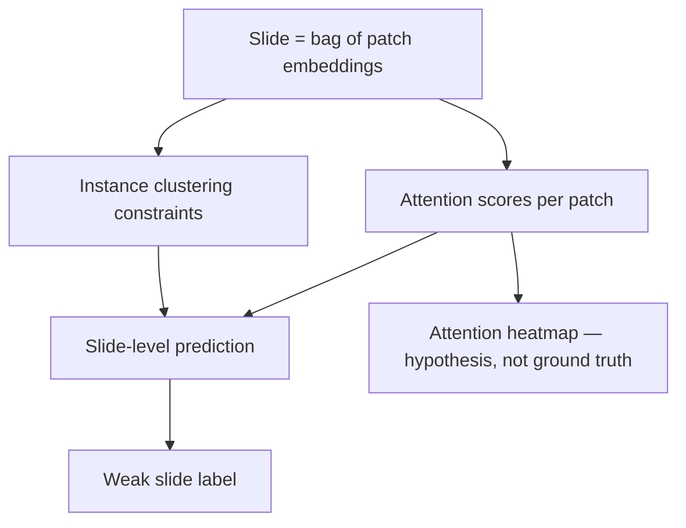
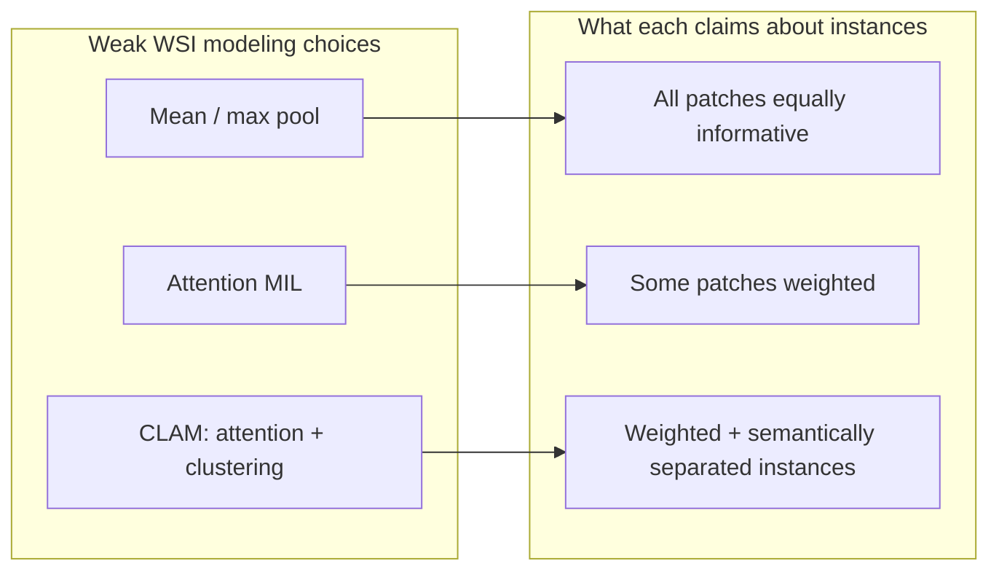

Reference: [Data-efficient and weakly supervised computational pathology on whole-slide images](https://www.nature.com/articles/s41551-020-00682-w). Ming Y. Lu, Drew F. K. Williamson, Tiffany Y. Chen, Richard J. Chen, Matteo Barbieri, and Faisal Mahmood. Nature Biomedical Engineering 2021.

This is not a summary of CLAM. What stayed with me is this: **weak supervision on whole-slide images works better when the model is forced to represent which instances might matter—not when it pretends every patch is equally plausible evidence.**

## The mechanism, briefly

CLAM (Clustering-constrained Attention Multiple Instance Learning) builds on attention-based MIL. Each slide is a bag of patch embeddings. An attention mechanism produces instance scores; slide-level prediction aggregates them.

CLAM adds two constraints that changed practice:

1. **Instance-level clustering:** patches are encouraged to separate into positive- and negative-semantic clusters at the embedding level
2. **Explicit instance-level supervision signals** in subtyping mode—where class-specific evidence is modeled separately

The model is data-efficient: strong performance with slide-level labels on TCGA and other cohorts, with attention heatmaps used to localize disease.

Attention heatmaps are hypotheses about evidence—not pathology confirmations.

<aside class="callout callout--key-idea" role="note">

Key idea

CLAM treats weak supervision as <em>structured ambiguity inside the bag</em>. The slide label constrains which instances may carry evidence; clustering and attention express uncertainty about which ones actually do.

</aside>

## What changed in my own thinking

Before CLAM, I thought of weak WSI supervision as: pool patches until the slide label is satisfied. CLAM pushed me to treat **instance ambiguity as modeling territory**, not as noise to average out.

This is the same conceptual move as [attention-based deep MIL](/blog/paper-notes/attention-based-deep-mil-attention-as-an-interface-not-an-explanation)—but CLAM makes the instance structure more explicit through clustering and subtyping heads. It connects to [what is weak supervision](/blog/small-explainers/what-is-weak-supervision): the label is incomplete, so the architecture must state how completion happens.

## Why this matters for pathology

A metastasis label on a lymph node slide does not tell you which patches contain tumor cells. A subtype label does not tell you whether the evidence is architectural, nuclear, or inflammatory. CLAM's design acknowledges that multiple instance configurations are consistent with the same bag label.

<aside class="callout callout--observation" role="note">

Observation

CLAM's heatmaps are most valuable when used to <em>generate review targets</em> for pathologists—not when cited as proof the model "found the tumor."

</aside>

Compared to [clinical-grade weak supervision](/blog/paper-notes/clinical-grade-weak-supervision-real-data-is-not-a-footnote), CLAM is often trained on cleaner research cohorts—but the instance ambiguity problem is identical in clinical report labels. The difference is noise source, not problem shape.

[HIPT](/blog/paper-notes/hipt-histology-has-a-natural-scale-hierarchy) asks whether patch embeddings are sufficient; CLAM asks which patches the slide label selects. Both questions matter simultaneously.

## MIL design space

## The caution I keep with the paper

**A persuasive attention heatmap still needs biological and dataset-aware validation.**

Failure modes:

- **Attention chasing artifact:** High attention on necrosis, fold, or pen marks that correlate with class prevalence.
- **Cluster semantics drift:** Clusters capture scanner color modes, not histologic subtypes.
- **Subtyping overconfidence:** Separate class heads imply separable instance evidence where biology is genuinely mixed.

<aside class="callout callout--misconception" role="note">

Common misconception

CLAM localizes disease because attention is interpretable. Attention localizes <em>where the model looked</em>—which may or may not be disease.

</aside>

See [what makes weak supervision difficult](/blog/research-notes/what-makes-weak-supervision-difficult) and [morphology before accuracy](/blog/research-notes/morphology-before-accuracy).

## How I use the idea now

When using CLAM or descendants:

1. **Gold-set localization eval:** Small set of patch- or region-level expert labels—not just slide AUC.
2. **Attention stability** across scanners and stains on the same cases.
3. **Negative control slides** where label is known absent—does attention stay quiet?

I treat CLAM as admitting uncertainty structurally; I still have to validate uncertainty empirically.

## Research question for my own work

**Does CLAM's instance clustering recover morphology-linked evidence—or prevalence-linked shortcuts—on my cohort?**

Diagnostic tests:

1. **Cluster morphology audit:** Sample high-attention patches per cluster; pathologist labels whether they share biological meaning or share artifact type. Clusters should not be dominated by "scanner A purple hue."

2. **Swap test:** Shuffle patch embeddings across slides of the same class label during inference (destroy spatial context). If slide predictions remain confident, the model may be using bag-level prevalence statistics, not localized evidence.

3. **Subtype head disagreement:** In multi-class settings, flag slides where class-specific attention maps highlight disjoint regions. Biological ambiguity is real; contradictory maps without acknowledged uncertainty are a warning.

Weak supervision works best when the model admits ambiguity. Validation must still ask whether the admitted ambiguity is the right kind.
