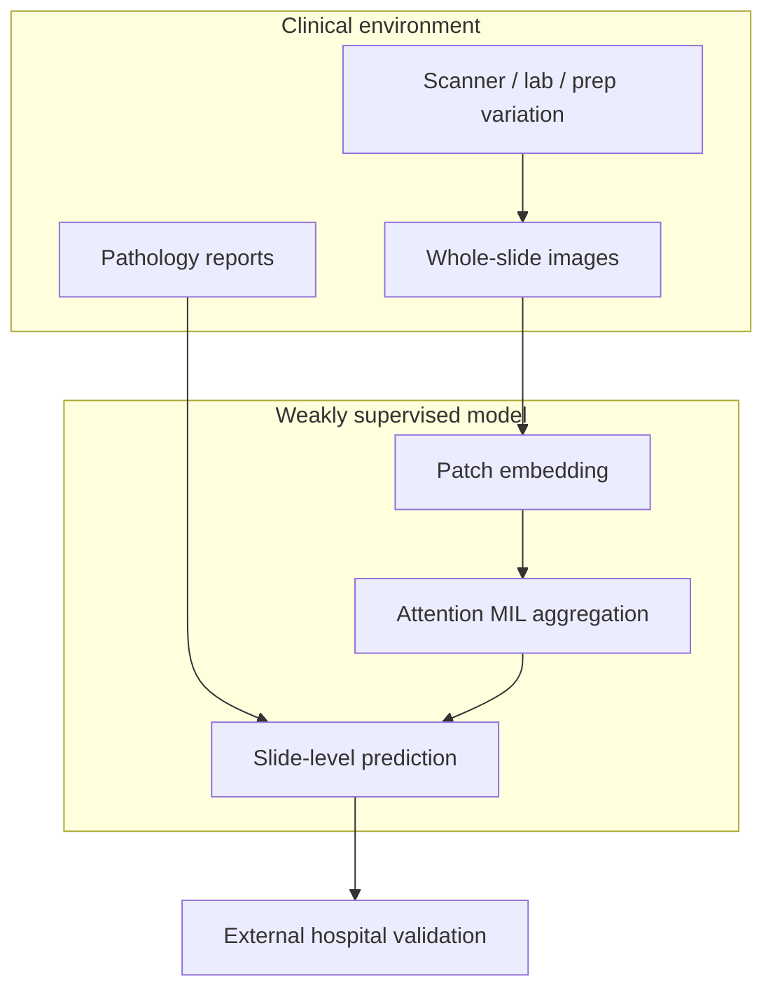
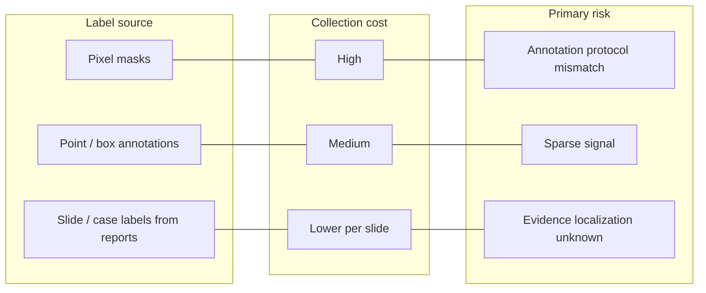

Reference: [Clinical-grade computational pathology using weakly supervised deep learning on whole slide images](https://www.nature.com/articles/s41591-019-0508-1). Gabriele Campanella, Matthew G. Hanna, Luke Geneslaw, Anne Mora, Jan S. Kerner, Jessica C. Venuti, Sarah K. Walsh, Moriah Morondu, Ilker Vahdati, Kimberly E. Alexander, Andrea S. Fuchs, Seth J. Song, David S. Klimstra, and Thomas J. Fuchs. Nature Medicine 2019.

This is not a summary of the Campanella et al. paper. What stayed with me is this: **weak supervision becomes scientifically credible when it is stress-tested inside real clinical variation—not when it wins on a curated patch benchmark with slide labels treated as an afterthought.**

## The idea that stayed with me

The study trained weakly supervised deep learning models on tens of thousands of H&E whole-slide images from routine clinical workflows at Memorial Sloan Kettering, using diagnostic labels derived from pathology reports—not pixel annotations. Models reached pathologist-level performance on prostate cancer detection and breast cancer metastasis in lymph nodes, with external validation on separate hospitals.

The methodological stack—ResNet patch encoder, attention-based MIL, slide-level binary classification—is familiar. The contribution that aged well is **environmental realism**: scanner diversity, lab workflow noise, label latency, and deployment-scale evaluation.

Clinical scale is not a virtue by itself. It is a stress test of assumptions.

<aside class="callout callout--key-idea" role="note">

Key idea

Weak labels from clinical systems are not "lesser ground truth." They are a different statement about the task—one that must be matched to evaluation and deployment, not apologized for in a limitations paragraph.

</aside>

## What changed in my own thinking

Before this paper, I mentally separated "method papers" from "clinical papers." Campanella blurred that line in a productive way. The architecture is not exotic; the **data contract** is the argument.

A slide label from a report encodes:

- what the pathologist concluded at sign-out
- what was clinically salient enough to mention
- institutional coding practices and threshold habits

It does not encode where on the slide the evidence lives. That gap is exactly the [weak supervision](/blog/small-explainers/what-is-weak-supervision) problem—and exactly why aggregation is part of the scientific model ([attention MIL](/blog/paper-notes/attention-based-deep-mil-attention-as-an-interface-not-an-explanation), [CLAM](/blog/paper-notes/clam-weak-supervision-works-best-when-it-admits-its-own-uncertainty)).

## Why this matters for pathology

Many pathology ML papers optimize on TCGA or similar archives with cleaner metadata than live clinical feeds. Campanella is a reminder that **the label generation process is part of the dataset**.

<aside class="callout callout--observation" role="note">

Observation

External validation on another hospital is not a bonus figure—it is the experiment that tests whether weak supervision learned biology or institution-specific reporting and staining habits.

</aside>

This connects to [what makes a medical AI paper convincing](/blog/research-notes/what-makes-a-medical-ai-paper-convincing) and [the hidden cost of biomedical datasets](/blog/research-notes/the-hidden-cost-of-biomedical-datasets): scale reveals coupling between method and environment.

## Weak supervision taxonomy in practice

Campanella lives in the third column. Methods that ignore that column's risks—by treating attention maps as ground truth—repeat a failure mode I discuss in CLAM and MIL notes.

## The caution I keep with the paper

**Clinical scale does not automatically solve bias; it can scale the hidden structure of one health system.**

Failure modes:

- **Report-label coupling:** Model learns correlated phrases in reports and visual shortcuts, not causal morphology.
- **Prevalence and spectrum bias:** Training distribution reflects who was biopsied and how cases were triaged.
- **Site-specific validation gaps:** "External" hospitals may still share reagents, scanners, or referral patterns.

<aside class="callout callout--failure" role="note">

Failure mode

A model validated at scale within one ecosystem looks deployment-ready—until a community hospital with different fixation and scanning protocols shows a shifted error mode that attention maps never highlighted during development.

</aside>

I carry the paper as a standard: if weak supervision is the claim, **clinical messiness must be in the training set and the evaluation—not only in the discussion.**

## How I use the idea now

When designing weakly supervised WSI studies, I document:

1. **Label provenance:** report, EMR code, retrospective chart review—each implies different noise
2. **Prevalence and case mix** vs. deployment setting
3. **External validation plan** before training—not after promising internal AUC
4. **Attention / instance review** as hypothesis generation, not explanation ([attention as interface](/blog/paper-notes/attention-based-deep-mil-attention-as-an-interface-not-an-explanation))

See also [what makes weak supervision difficult](/blog/research-notes/what-makes-weak-supervision-difficult).

## Research question for my own work

**If my weak supervision only works on clinically realistic data—when the label is a report and the slide contains artifacts—what failure remains invisible on cleaner subsets?**

Diagnostic tests:

1. **Cohort stratification audit:** Report AUC separately by scanner, year, staining batch, and pathologist sign-out volume. Campanella-style credibility requires stability—or named instability—across strata.

2. **Label ablation:** Compare report-derived labels vs. expert-reviewed slide labels on a small gold subset. Quantify how often weak labels are wrong in ways the model cannot recover via aggregation.

3. **Deployment simulation:** Introduce realistic workflow delays—QC failures, rescans, partial slides—and measure whether performance claims hold. Real data is not a footnote; it is the environment.

Weak supervision at clinical grade is not an architecture choice. It is a commitment to evaluate inside the mess.
