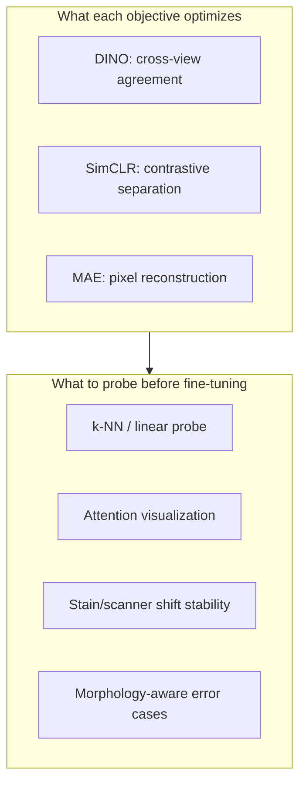

Reference: [Emerging Properties in Self-Supervised Vision Transformers](https://arxiv.org/abs/2104.14294). Mathilde Caron, Hugo Touvron, Ishan Misra, Herve Jegou, Julien Mairal, Piotr Bojanowski, and Armand Joulin. ICCV 2021.

This is not a summary of DINO. What stayed with me is this: **self-supervised ViTs can expose spatial structure—object boundaries, parts, correspondences—before any task label is introduced. That is scientifically interesting and clinically insufficient unless you verify what structure emerged.**

## The mechanism, briefly

DINO (self-**Di**stillation with **no** labels) trains a student ViT to match the output distribution of a momentum-averaged teacher on different crops of the same image. There are no explicit negative pairs (unlike [SimCLR](/blog/paper-notes/simclr-augmentation-is-a-scientific-assumption)). Multi-crop training supplies scale variation; centering and sharpening stabilize the teacher targets.

The surprising empirical finding: self-attention maps from the last layer often highlight object parts and boundaries on ImageNet—without segmentation supervision.

<span class="margin-note">Emergent structure is a probe result, not a guarantee about pathology semantics.</span>

<aside class="callout callout--key-idea" role="note">
<p class="callout-label">Key idea</p>
<div class="callout-body">
<p>DINO suggests that some spatial organization is recoverable from generic self-supervision—but <em>which</em> organization emerges depends on image statistics, crop policy, and architecture, not on clinical intent.</p>
</div>
</aside>

```mermaid
flowchart LR
  IMG[Image] --> C1[Global crops]
  IMG --> C2[Local crops]
  C1 --> T[Teacher ViT (momentum)]
  C2 --> S[Student ViT]
  T --> KD[Distillation loss]
  S --> KD
  S --> ATT[Self-attention maps]
  ATT --> EM[Emergent part/boundary structure]
```

## What changed in my own thinking

I used to treat unlabeled histology slides as "pretraining data waiting for labels." DINO shifted me toward **representation probing as a first-class step**.

If a ViT trained with DINO on histology shows attention on tissue boundaries, that is worth knowing before fine-tuning—because it might mean:

- the model sees compartments pathologists care about
- the model sees fold lines, ink marks, or scanner seams with equal conviction

The paper's ImageNet demonstrations are compelling. They do not transfer by analogy alone. [What is representation learning](/blog/small-explainers/what-is-representation-learning) in pathology must include: *useful for what task, under what stain, at what scale?*

## Why this matters for pathology

Unlabeled WSIs are abundant; pixel labels are scarce. That imbalance makes self-supervised pretraining attractive. DINO offers something [MAE](/blog/paper-notes/mae-reconstruction-is-useful-only-when-the-missingness-is-meaningful) does not: relatively direct visual probes via attention without decoding pixels.

<aside class="callout callout--observation" role="note">
<p class="callout-label">Observation</p>
<div class="callout-body">
<p>Attention on a nucleus boundary and attention on a staining gradient can look equally crisp in a heatmap. Qualitative maps require biological grounding—not enthusiasm.</p>
</div>
</aside>

This connects to [HIPT](/blog/paper-notes/hipt-histology-has-a-natural-scale-hierarchy): emergent structure at patch scale does not replace region-scale reasoning. It may not even align with it.

I also read DINO alongside weak supervision papers ([CLAM](/blog/paper-notes/clam-weak-supervision-works-best-when-it-admits-its-own-uncertainty), [attention MIL](/blog/paper-notes/attention-based-deep-mil-attention-as-an-interface-not-an-explanation)): self-supervised structure is not slide-level evidence. Fine-tuning on bag labels can overwrite or exploit emergent features in ways probes will not predict.

## Self-supervised objective comparison



## The caution I keep with the paper

**Emergent structure is not automatically the structure a pathologist cares about.**

Failure modes:

- **Natural-image objectness:** Boundaries follow contrast edges that correlate with stain, not with diagnostic objects.
- **Crop bias:** Local crops emphasize texture; global crops miss nuclear detail.
- **Fine-tuning erasure:** Downstream training on weak labels rewards shortcuts that hide emergent structure without deleting it from weights.

<aside class="callout callout--failure" role="note">
<p class="callout-label">Failure mode</p>
<div class="callout-body">
<p>Beautiful attention maps on 20 unlabeled slides become the figure in the grant proposal—while the fine-tuned model ignores those regions and predicts from artifact density.</p>
</div>
</aside>

See [foundation models are powerful but not magic](/blog/research-notes/foundation-models-are-powerful-but-not-magic) for the broader pattern: impressive probes ≠ clinical validity.

## How I use the idea now

My pretraining checklist:

1. **Probe before fine-tune:** k-NN on coarse tissue types if available; attention review with a pathologist on hard slides.
2. **State crop policy as assumption:** same question as SimCLR augmentations—what views are declared equivalent?
3. **Separate emergence from evaluation:** downstream AUC is not proof the emergent structure was used.

This aligns with [morphology before accuracy](/blog/research-notes/morphology-before-accuracy): understand what the representation encodes before celebrating the score.

## Research question for my own work

**Does DINO on histology emerge pathologist-aligned structure—or scanner-aligned structure—and can I tell before spending labels on fine-tuning?**

Diagnostic tests:

1. **Stain-perturbation attention test:** Apply stain normalization or color jitter to held-out slides; measure attention map stability on known structures vs. on artifact regions. Stable attention on artifacts is a warning sign.

2. **Pathologist spot-check protocol:** Sample 30 slides stratified by scanner and tissue type. Ask: "Does high-attention regions match your diagnostic reading?" Record agreement rate separately per site—not pooled.

3. **Frozen vs. fine-tuned probe divergence:** Compare k-NN and attention structure before and after MIL fine-tuning. Large divergence means emergent structure was not what the weak label selected—important for interpreting [what makes weak supervision difficult](/blog/research-notes/what-makes-weak-supervision-difficult).

Structure before labels is possible. Alignment with the clinical question is not free.
