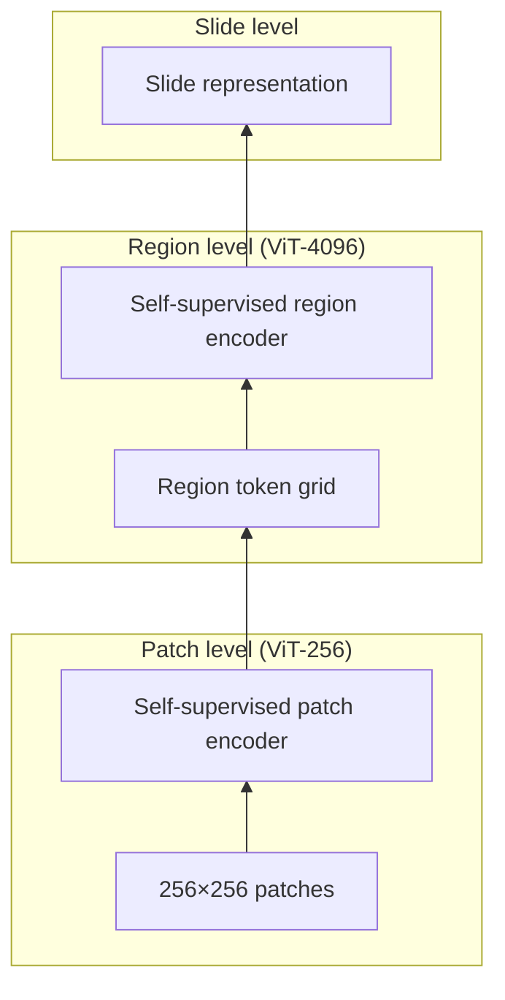
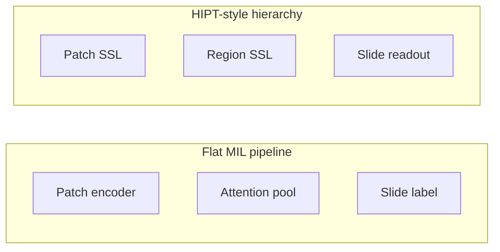

Reference: [Scaling Vision Transformers to Gigapixel Images via Hierarchical Self-Supervised Learning](https://arxiv.org/abs/2206.02647). Richard J. Chen, Chengkuan Chen, Yicong Li, Tiffany Y. Chen, Andrew D. Beck, and Faisal Mahmood. CVPR 2022.

This is not a summary of HIPT. What stayed with me is this: **a whole-slide image is not a big patch—it is a hierarchy, and models that ignore the hierarchy are making a biological claim whether they admit it or not.**

## The idea that stayed with me

HIPT (Hierarchical Image Pyramid Transformer) builds representations at three levels:

1. **ViT-256:** self-supervised learning on 256×256 patches (local morphology)
2. **ViT-4096:** aggregates 16×16 grids of patch embeddings into region-level tokens (mesoscale context)
3. **Slide-level readout:** combines region representations for downstream tasks

The hierarchy is not just memory management. It mirrors how pathologists move between magnification levels: nuclear detail, glandular architecture, tissue context.

Multi-scale design is a biological assumption, not only a GPU workaround.

<aside class="callout callout--key-idea" role="note">

Key idea

HIPT treats scale as part of the representation—not as a preprocessing nuisance to be collapsed by a single patch encoder plus pooling.

</aside>

## What changed in my own thinking

Before HIPT, I treated WSI modeling as: extract many patches → encode independently → aggregate (attention MIL, mean pooling, etc.). The aggregation step felt like engineering.

After HIPT, I treat **where scale enters the architecture** as part of the scientific model. A single-scale encoder with slide-level attention assumes that patch embeddings are sufficient and that aggregation only needs to weight them. HIPT assumes that region-level structure requires its own representation learning stage—not just a weighted sum of patch features.

This reframes comparisons with [CLAM](/blog/paper-notes/clam-weak-supervision-works-best-when-it-admits-its-own-uncertainty) and [attention-based MIL](/blog/paper-notes/attention-based-deep-mil-attention-as-an-interface-not-an-explanation): attention tells you which patches matter; hierarchy tells you whether patch-level features are the right currency at all.

## Why this matters for pathology

Histopathology is challenging precisely because meaning is distributed across scales—see [what makes histopathology challenging](/blog/small-explainers/what-makes-histopathology-challenging). A mitotic figure matters at high magnification; tumor grade integrates patterns visible only at lower power; immune exclusion is inherently contextual.

<aside class="callout callout--observation" role="note">

Observation

Many WSI benchmarks reward slide-level AUC while the model never represents the mesoscale structures pathologists use to justify the diagnosis. Hierarchy makes that gap harder to ignore.

</aside>

HIPT also connects to self-supervised pretraining debates ([DINO](/blog/paper-notes/dino-representation-learning-can-expose-structure-before-labels-arrive), [MAE](/blog/paper-notes/mae-reconstruction-is-useful-only-when-the-missingness-is-meaningful), [SimCLR](/blog/paper-notes/simclr-augmentation-is-a-scientific-assumption)): pretraining objectives at patch level do not automatically produce region-level semantics. HIPT trains both—with separate objectives—making the scale assumption explicit.

## Hierarchy vs. flat MIL

Flat MIL can work. But it embeds a claim: region semantics are linearly recoverable from patch tokens. HIPT embeds a different claim: region semantics need their own stage. Which claim fits your task is an empirical and biological question—not a default.

## The caution I keep with the paper

**Hierarchy organizes information; it does not decide which biological relationships are meaningful.**

Failure modes:

- **Wrong scale boundaries:** Fixed 256/4096 tiling may not align with gland or lobule structure.
- **Pretraining-task mismatch:** Self-supervised losses at patch level may optimize texture that region-level stages propagate.
- **Clinical label distance:** Slide labels from [clinical-scale weak supervision](/blog/paper-notes/clinical-grade-weak-supervision-real-data-is-not-a-footnote) may not align with any level of the hierarchy.

<aside class="callout callout--misconception" role="note">

Common misconception

Adding hierarchy automatically adds interpretability. You get structured tensors—not guaranteed pathologist-aligned concepts.

</aside>

## How I use the idea now

When reading a new pathology foundation model, I ask:

1. at which **magnifications** was it pretrained?
2. where does **context enter**—patch encoder, cross-patch module, slide head?
3. what **evidence** links each scale to the clinical label?

I connect this to [why pathology differs from natural images](/blog/research-notes/why-pathology-is-different-from-natural-images) and [foundation models are powerful but not magic](/blog/research-notes/foundation-models-are-powerful-but-not-magic).

## Research question for my own work

**Does my task's evidence live at patch scale, region scale, or both—and does the model represent both or only simulate both via pooling?**

Diagnostic tests:

1. **Scale ablation at inference:** Run slide prediction with patch-level features only, region-level only, and full hierarchy. If performance collapses when region stage is removed on tasks pathologists describe as "architecture-heavy," the hierarchy is doing real work. If not, the model may be patch-texture classifying.

2. **Cross-magnification consistency:** Extract attention or saliency at patch vs. region levels for the same slide. Misalignment—hot regions that pathologists read as normal at low power—signals scale confusion.

3. **Held-out magnification generalization:** Train on patches sampled at one magnification distribution; test on slides scanned with different objective usage. Hierarchy should help if it encodes multi-scale biology; it will not help if it encodes scanner-specific tiling artifacts.

Scale is structure in histology. The model should say which scales it believes—not bury them in a pool.
