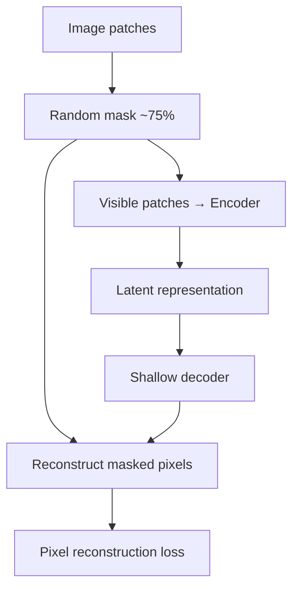
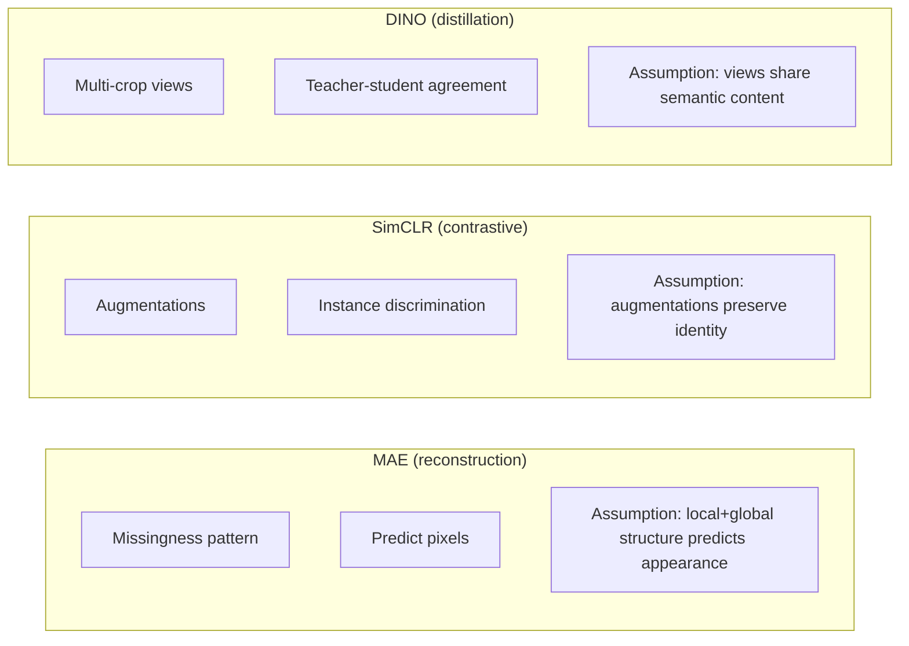

Reference: [Masked Autoencoders Are Scalable Vision Learners](https://arxiv.org/abs/2111.06377). Kaiming He, Xinlei Chen, Saining Xie, Yanghao Li, Piotr Dollár, and Ross Girshick. CVPR 2022.

This is not a summary of MAE. What stayed with me is sharper: **reconstruction teaches representations only when the pattern of missingness forces the model to learn structure you care about—not when it can cheat with local texture statistics.**

## The mechanism, briefly

MAE masks a high fraction of image patches (typically 75%), encodes only the visible patches with a ViT encoder, then decodes to reconstruct pixel values in the masked regions. The encoder sees a sparse subset; the decoder is lightweight and discarded after pretraining.

The asymmetry matters. The encoder cannot rely on trivial interpolation from immediate neighbors because most neighbors are also missing. It must build a representation that supports long-range prediction.

Masking ratio is not a speed knob. It defines how much context the encoder must internalize.

<aside class="callout callout--key-idea" role="note">

Key idea

MAE does not ask "what is in the image?" It asks "what must be true about the visible patches to predict the missing ones?" The answer depends entirely on how missingness is sampled.

</aside>

## What changed in my own thinking

I used to equate "self-supervised pretraining" with "learns semantics without labels." MAE made me separate **pixel prediction** from **concept learning**.

Reconstructing pixels well can mean:

- understanding object layout and global scene structure (what the paper demonstrates on ImageNet)
- exploiting repetitive micro-texture (common in histology)
- memorizing stain color distributions within a patch

Histology patches often contain strongly repetitive texture: chromatin speckle, stromal collagen, cytoplasmic granularity. A model can reconstruct masked regions by continuing local texture without understanding nuclear grade, invasion front, or immune context.

This connects to [representation learning](/blog/small-explainers/what-is-representation-learning): a useful representation for one task can be harmful for another if it preserves the wrong invariances—see also [SimCLR](/blog/paper-notes/simclr-augmentation-is-a-scientific-assumption) for the augmentation version of the same warning.

## Why this matters for pathology

Whole-slide images have hierarchy: cells within glands within tissue neighborhoods within slides. Random patch masking on a 224×224 field may never force the model to reason across scales that pathologists use when they change magnification.

<aside class="callout callout--observation" role="note">

Observation

Random MAE masking on histology patches can produce excellent reconstruction by filling in more of the same stain texture—while learning almost nothing about the spatial arrangement that defines tumor budding or immune exclusion.

</aside>

[HIPT](/blog/paper-notes/hipt-histology-has-a-natural-scale-hierarchy) addresses a different part of the problem: explicit scale hierarchy. MAE addresses within-patch prediction. The combination is tempting, but the assumption question remains: *what missingness pattern matches the biology?*

Possible pathology-specific masking hypotheses (stated as hypotheses, not established recipes):

- mask entire glandular units to force context from stroma
- mask at nuclear scale only when the downstream task is nuclear
- avoid masking that destroys stain channels the task treats as signal

I have not seen a single canonical answer. The point is that "apply MAE to histology" is underspecified in the same way "apply SimCLR" is.

## Reconstruction vs. contrastive vs. distillation

[DINO](/blog/paper-notes/dino-representation-learning-can-expose-structure-before-labels-arrive) often yields interpretable attention structure without pixel targets. MAE yields strong encoders for fine-tuning but weaker direct interpretability. The choice is not "which is better" but "which assumption matches the failure mode I can tolerate."

## The caution I keep with the paper

**Reconstructing pixels is not the same as understanding morphology.**

Failure modes:

- **Texture hallucination:** Smooth, plausible infill that scores low reconstruction error but blurs nuclear membranes.
- **Stain shortcut:** Representation encodes lab-specific color statistics because they dominate pixel prediction.
- **Scale mismatch:** Encoder optimized for patch interior cannot support slide-level reasoning without an explicit aggregation design ([attention MIL](/blog/paper-notes/attention-based-deep-mil-attention-as-an-interface-not-an-explanation), CLAM, etc.).

<aside class="callout callout--failure" role="note">

Failure mode

Downstream accuracy improves after MAE pretraining, but error maps show the model still fails on biologically hard cases—because pretraining never required predicting anything those cases depend on.

</aside>

## How I use the idea now

Before MAE-style pretraining on histology, I write:

1. what structure **must** be inferred from visible context
2. what patterns would let the model **cheat** via texture continuation
3. what probe will test **morphology retention**—not only linear probe accuracy

This parallels [morphology before accuracy](/blog/research-notes/morphology-before-accuracy): the pretraining objective is a hypothesis about what information is sufficient.

## Research question for my own work

**Does random patch masking force the encoder to learn the morphology my task requires—or only the texture statistics of H&E at one magnification?**

Diagnostic tests:

1. **Structured vs. random mask ablation:** Pretrain two encoders—identical architecture, identical data—differing only in masking (random vs. structure-aware, e.g., mask contiguous superpixels). Compare frozen-feature probes on tasks requiring layout (gland formation) vs. texture (stroma classification). If random masking wins only on texture tasks, the default MAE setup is aligned with texture, not layout.

2. **Reconstruction inspection:** Visualize reconstructions on hard cases (overlapping nuclei, necrosis, crush artifact). High-quality infill with wrong nuclear boundaries is a red flag for downstream segmentation—even if linear probe accuracy looks fine.

3. **Cross-magnification transfer:** Pretrain at 20×, probe at 10× and 40× on the same tissue types. Large drops suggest the representation locked onto scale-specific texture rather than transferable morphology.

Reconstruction is useful when missingness is meaningful. Random masking on histology is not automatically meaningful.
