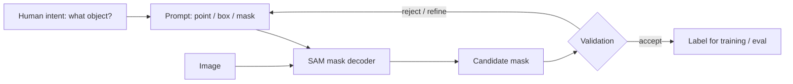
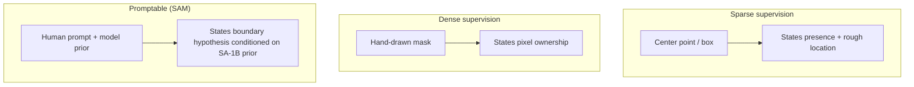

Reference: [Segment Anything](https://arxiv.org/abs/2304.02643). Alexander Kirillov, Eric Mintun, Nikhila Ravi, Hanzi Mao, Chloe Rolland, Laura Gustafson, Tete Xiao, Spencer Whitehead, Alexander C. Berg, Wan-Yen Lo, Piotr Dollár, and Ross Girshick. ICCV 2023.

This is not a summary of SAM. What stayed with me is this: **promptability changes the annotation workflow, not the scientific obligation to define what is being segmented.**

## The idea that stayed with me

SAM reframes segmentation as a prompt-conditioned mapping: points, boxes, coarse masks, or automatic mask generation proposals produce segmentations without task-specific retraining. The model was trained on SA-1B—over a billion masks from diverse natural images—using a promptable mask decoder atop an image encoder.

The engineering is impressive. The scientific shift is subtler: annotation becomes an interactive loop where the human supplies intent and the model supplies boundary hypotheses.

A prompt is not neutral. It encodes what the annotator believes the object is.

<aside class="callout callout--key-idea" role="note">

Key idea

SAM separates <em>finding a boundary</em> from <em>deciding which boundary answers the biological question</em>. The second decision remains human—and remains the part most papers under-specify.

</aside>

## What changed in my own thinking

Before SAM, I thought of annotation as a choice between expensive masks and cheaper points ([center points vs. segmentation masks](/blog/small-explainers/center-points-vs-segmentation-masks)). After SAM, I think of annotation as a **three-party conversation**: pathologist intent, model prior, evaluation definition.

A point prompt on a nucleus might produce a tight nuclear mask—or a mask that includes cytoplasm—depending on where the click lands and what SAM learned about "objectness" in natural images. The mask is not wrong in a computer-vision sense. It may be wrong for a Ki-67 scoring protocol that requires exclusion of overlapping lymphocytes.

This is why [annotation quality](/blog/small-explainers/why-annotation-quality-matters) is not about visual neatness. It is about whether the label matches the task, the biology, and the evaluation.

## Why this matters for pathology

Pathology segmentation tasks rarely ask for generic foreground/background separation. They ask for:

- nuclear boundaries under overlap and blur
- tumor regions with invasive front definitions agreed by pathologists
- tissue compartments where stroma-tumor interfaces are ambiguous
- structures whose definition varies by guideline (e.g., Gleason pattern boundaries)

SAM's pretraining distribution does not include these definitional debates. It includes many objects with relatively crisp natural-image boundaries. Transfer to H&E can work surprisingly well for coarse structures—and fail silently for fine-grained diagnostic objects.

<aside class="callout callout--observation" role="note">

Observation

SAM can accelerate annotation throughput while <em>decreasing</em> label alignment if reviewers accept model boundaries because they look plausible. Plausibility is not the same as protocol compliance.

</aside>

The paper also clarified responsibility allocation. If a downstream model fails because masks followed SAM's notion of "nucleus" rather than the lab's SOP, that is not a segmentation architecture failure. It is a workflow failure—one that promptable tools make easier to hide.

## Promptability vs. other supervision modes

SAM sits in the promptable column: richer than a center point, but still dependent on a prior that was not trained on your guideline document.

## The caution I keep with the paper

**A promptable mask still needs validation when the image distribution and object definition differ from the pretraining world.**

Failure modes I watch for:

- **Boundary convention drift:** Masks are consistently 2–3 pixels wider than pathologist-drawn training data, shifting size-based features.
- **Ambiguity resolution:** SAM always returns a mask; pathology often requires "uncertain" or "skip" for overlapping cells.
- **Distribution shift:** Scanner, stain, and magnification changes alter what "looks segmentable" to a natural-image prior.

<aside class="callout callout--misconception" role="note">

Common misconception

Faster annotation is the same as better labels. Promptable models change the error type—from omission and sloppiness to systematic prior mismatch.

</aside>

## How I use the idea now

When evaluating SAM (or pathology-tuned descendants) in a project, I document:

1. the **object definition** (what counts as foreground)
2. the **prompt protocol** (point vs. box, who clicks, refinement rules)
3. the **accept/reject criteria** for model proposals
4. the **evaluation target** (does the task need exact area or only detection?)

This mirrors how I read [CLAM](/blog/paper-notes/clam-weak-supervision-works-best-when-it-admits-its-own-uncertainty) and [clinical-scale weak supervision](/blog/paper-notes/clinical-grade-weak-supervision-real-data-is-not-a-footnote): the method is embedded in a data-generating process, not isolated from it.

## Research question for my own work

**Can promptable segmentation improve label throughput without changing what the label means?**

Diagnostic test:

1. **Protocol agreement study:** Have two pathologists segment the same 50 objects manually and with SAM-assisted prompts. Measure inter-rater agreement (Dice, boundary distance) for each mode. If SAM-assisted agreement is higher *and* both raters deviate from the written protocol in the same direction, the model is homogenizing errors—not reducing them.

2. **Feature stability test:** Train a simple downstream model (e.g., nuclear size regression) on manual masks vs. SAM-refined masks. If coefficients shift but accuracy stays flat, the headline metric is hiding a label definition change—exactly the failure described in [morphology before accuracy](/blog/research-notes/morphology-before-accuracy).

3. **Prompt sensitivity:** Repeat segmentation with perturbed prompts (click offset by 3 pixels). Large mask changes on small prompt moves indicate the tool is resolving ambiguity the protocol should have named explicitly.

Promptability changes annotation. It does not remove the obligation to define the object.
