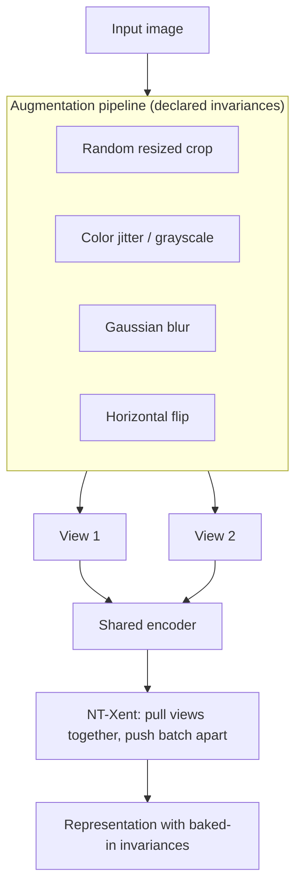
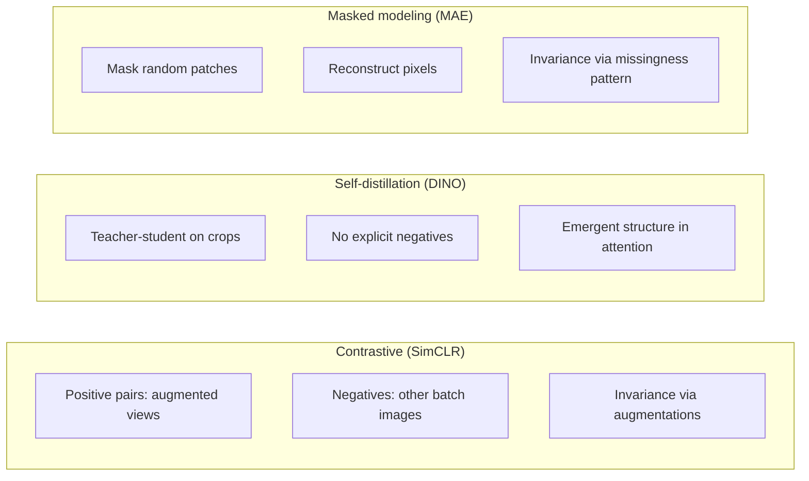

Reference: [A Simple Framework for Contrastive Learning of Visual Representations](https://arxiv.org/abs/2002.05709). Ting Chen, Simon Kornblith, Mohammad Norouzi, and Geoffrey Hinton. ICML 2020.

This is not a summary of SimCLR. What stayed with me is a sharper claim: **contrastive learning does not discover invariances—it installs them through augmentation design.**

## The mechanism, briefly

SimCLR trains a encoder on pairs of augmented views from the same image. Two views of image *i* are pulled together in embedding space; views from all other images in the batch are pushed apart via normalized temperature-scaled cross-entropy (NT-Xent). The encoder never sees labels. It sees only the augmentation pipeline and the batch structure.

The paper's empirical sweep is instructive: composition of augmentations matters more than architecture width, and some augmentations (random crop, color distortion) are load-bearing while others contribute less. That is not a footnote about hyperparameters. It is a statement about what the objective can learn without.

Augmentation is not regularization here. It is the definition of "same object, different view."

<aside class="callout callout--key-idea" role="note">

Key idea

SimCLR does not ask the network to infer which transformations preserve identity. The researcher declares that identity in advance—through crop, color jitter, blur, and flip choices—and the loss enforces it.

</aside>

## What changed in my own thinking

Before SimCLR, I treated augmentations as a regularization layer—something you tune after choosing the architecture and loss. After SimCLR, I treat them as **biological and operational claims**.

In natural images, aggressive color jitter assumes that object identity survives large hue and saturation shifts. In H&E histology, that assumption is not obviously true. Stain intensity and chromatin texture often carry diagnostic signal. A representation trained to be invariant to color distortion may be exactly the representation you do not want for a nucleus-grading task, even if it transfers well to a tissue-type classifier on the same scanner.

This connects to my notes on [representation learning](/blog/small-explainers/what-is-representation-learning) and [why pathology differs from natural images](/blog/research-notes/why-pathology-is-different-from-natural-images). The same encoder objective can produce opposite conclusions depending on what you declared invariant.

## Why this matters for pathology

Computational pathology images arrive with a long preparation history: fixation, sectioning, staining, scanning, tiling. Each step leaves traces. Some traces are nuisance (folds, bubbles, out-of-focus regions). Some are signal (eosinophilia, nuclear pleomorphism, immune infiltrate patterns).

SimCLR-style training forces a choice: which of these traces should two "views" of the same patch share? If both views preserve stain artifacts but destroy nuclear boundaries (via heavy blur), the representation will organize around artifacts. If both views preserve nuclear texture but randomize stain hue, the representation may discard clinically relevant intensity patterns.

<aside class="callout callout--observation" role="note">

Observation

Two pathology projects can both say they use "SimCLR pretraining" and mean different scientific objects—one invariant to stain, one invariant to rotation but not stain—without changing a line of the loss function.

</aside>

The paper also changed how I read downstream gains. A linear probe improvement after SimCLR pretraining does not tell me the representation is "better for pathology." It tells me the augmentations and pretraining distribution aligned with something the probe could use. That alignment may be morphology, scanner signature, or tissue prevalence—evaluation has to separate them.

## Comparison with other self-supervised families

SimCLR belongs to the contrastive family: learn by distinguishing views. [DINO](/blog/paper-notes/dino-representation-learning-can-expose-structure-before-labels-arrive) uses self-distillation without explicit negatives. [MAE](/blog/paper-notes/mae-reconstruction-is-useful-only-when-the-missingness-is-meaningful) learns by reconstructing masked patches. The supervision taxonomies differ:

None of these removes the assumption question. They relocate it—from augmentations to masking patterns to teacher temperature schedules.

## The caution I keep with the paper

The most dangerous failure is not collapse or trivial solutions. It is **plausible invariance to the wrong feature**.

A representation can become excellent at slide-level tasks by learning scanner and lab signatures that are stable under the chosen augmentations but brittle under site shift. The model looks strong on the internal validation set and fails quietly when the stain protocol changes—because the augmentations never forced it to treat stain as variable.

<aside class="callout callout--failure" role="note">

Failure mode

The representation becomes invariant to exactly the cue the downstream pathologist cares about—because that cue was randomized away in pretraining and never reintroduced during fine-tuning.

</aside>

I try to carry SimCLR as a question, not a recipe: *what did we declare should not change identity, and is that still true in my cohort?*

## How I use the idea now

In my research notes, I write the intended invariance before choosing a method. For weak supervision, I ask how the bag label connects to instances ([CLAM](/blog/paper-notes/clam-weak-supervision-works-best-when-it-admits-its-own-uncertainty), [attention MIL](/blog/paper-notes/attention-based-deep-mil-attention-as-an-interface-not-an-explanation)). For sparse nucleus supervision, I ask what the center point asserts and what it leaves unobserved ([center points vs. masks](/blog/small-explainers/center-points-vs-segmentation-masks)). For contrastive pretraining, I list augmentations as hypotheses, not defaults.

## Research question for my own work

**If SimCLR-style invariances fail plausibly in pathology, what would that look like?**

Diagnostic test I would run before trusting a contrastively pretrained encoder:

1. **Stain-shift probe:** Fine-tune a linear probe on site A, evaluate on site B with matched labels. Then repeat with stain-normalized inputs. If performance recovers mainly from normalization—not from the representation—stain invariance was likely baked in incorrectly.

2. **Augmentation ablation on frozen features:** Extract embeddings with and without applying each augmentation at inference time (e.g., heavy color jitter on held-out patches). If embeddings drift more for biologically meaningful stain variation than for random noise, the augmentation assumptions are misaligned with the biology.

3. **Morphology retention check:** Cluster embeddings and inspect whether clusters follow tissue compartments and nuclear morphology, or scanner batch and section thickness. Qualitative, but necessary—see my note on [morphology before accuracy](/blog/research-notes/morphology-before-accuracy).

That translation step—paper insight into a falsifiable diagnostic—is where reading becomes research design.
