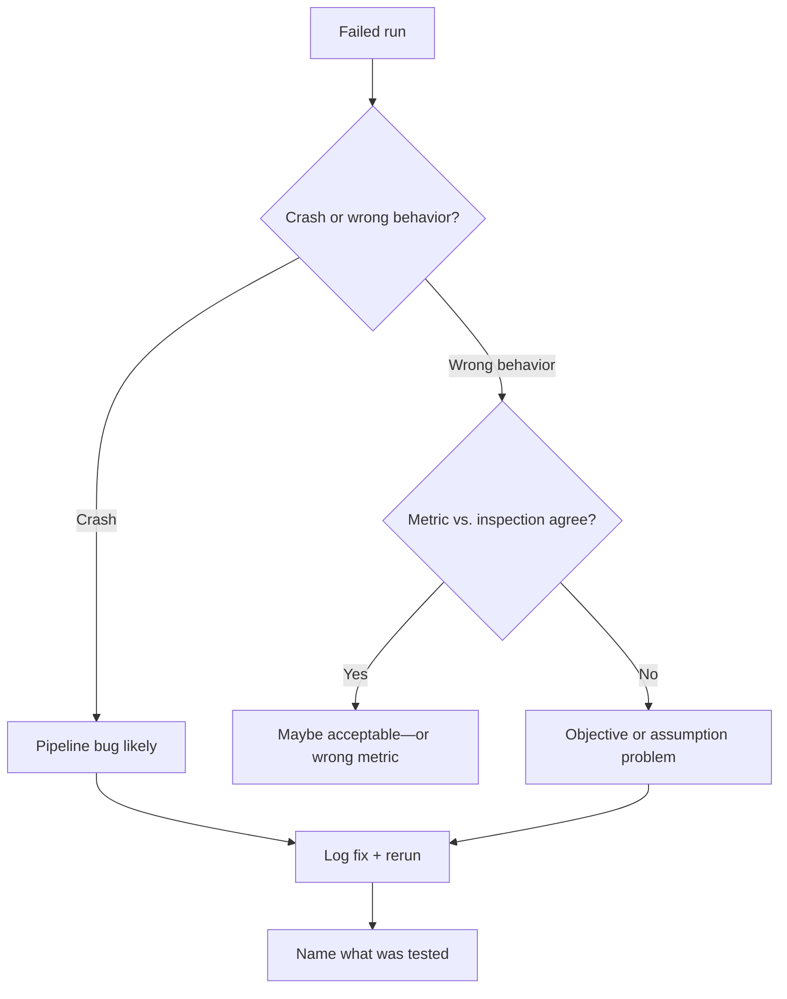

I still dislike failed experiments. I have not reached some enlightened state where broken code or flat results feel pleasant. What changed is that failure became less personal when I started reading experiments as measurements instead of verdicts.

## A specific failure that taught me

During early ShadoNet training—documented in [week 3 of the development journal](/blog/building-shadonet/week-3-the-first-failed-experiments)—the model produced plausible outputs while learning a stain shortcut. Loss decreased. Detection metrics improved slightly. Visual inspection showed responses on eosinophilic background rather than on nucleus boundaries.

A failed experiment is most useful when it preserves information about what was actually tested.

My first reaction was defensive: maybe the augmentations were wrong, maybe the learning rate, maybe I should run longer. My second reaction—after a day of unproductive tuning—was to write down what the experiment had actually tested. The answer was embarrassing: it tested whether the current objective could be satisfied, not whether it enforced morphology.

<aside class="callout callout--observation" role="note">

Observation

The experiment did not fail because I am bad at coding. It failed because the claim and the loss were misaligned—a useful diagnosis I would have missed if I had treated the run as a verdict on my ability.

</aside>

## The thing I misunderstood

I treated failure as something to fix quickly or hide quietly. Both responses discard information. [What makes weak supervision difficult](/blog/research-notes/what-makes-weak-supervision-difficult) describes a structural reason failures happen: under-specified labels give models room to satisfy the loss without learning what you intended. That is not a personal flaw. It is a design problem.

<aside class="callout callout--key-idea" role="note">

Key idea

Logging failures with enough detail that they can teach you later—claim tested, expected failure modes, what inspection showed—is more valuable than a success you cannot explain.

</aside>

## What I do differently now

When a run fails, I try to answer four questions before touching hyperparameters:

1. What claim was this run supposed to support?
2. What seductive failure did I predict beforehand?
3. Did inspection agree with the metric?
4. Is this a bug, a weak objective, or a wrong assumption?

That checklist comes directly from ShadoNet debugging. It applies elsewhere.

<aside class="callout callout--misconception" role="note">

Common misconception

A failed week is not necessarily an unproductive week. A week that ends with a sharper failure mode and a revised question is progress—even when there is no new figure for the slide deck.

</aside>

## Open question I am sitting with

I want to build a failure log template: date, hypothesis, prediction, outcome, category (bug / objective / assumption), next action. Not for performance tracking—for memory. Research forgets quickly when every experiment has three versions.

I still do not know how to stay emotionally steady when a month of work collapses into a misaligned loss function. Naming the problem helps intellectually. The stomach-drop feeling has not disappeared—and I am unsure it should.
