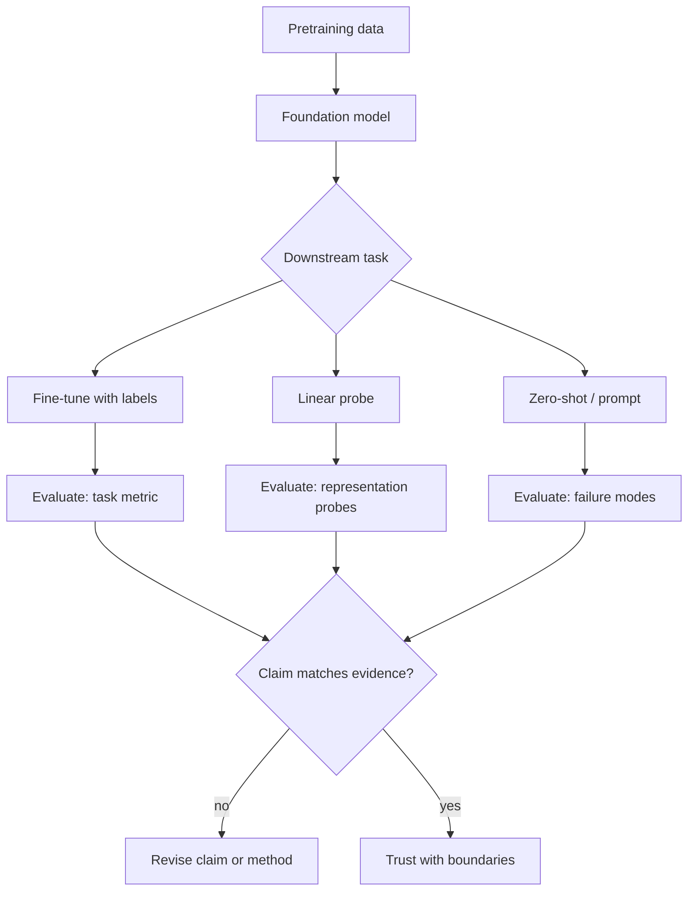

The phrase *foundation model* has a way of making hard problems sound temporarily solved.

I do not mean that cynically. Large pretrained models have genuinely changed what is feasible in computational pathology. A slide encoder trained on millions of patches can carry structure that a task-specific model trained from scratch may never see. Promptable segmentation models can reduce annotation friction. Self-supervised objectives can learn useful features before expensive labels arrive.

But the phrase also encourages a kind of intellectual outsourcing. If the model is already pretrained, the hard questions—what it learned, from what distribution, under what shortcuts—can feel like someone else's problem. They are not.

I keep catching myself treating "pretrained" as synonymous with "ready." It is not.

Foundation models are powerful starting points. They are not exemptions from evaluation, from domain specificity, or from the obligation to say what a representation actually encodes.

<aside class="callout callout--key-idea" role="note">

Key idea

A foundation model is an experimental organism, not a finished product. Its value depends on what structure survived pretraining—and what dataset habits it absorbed at scale.

</aside>

## What pretraining actually buys you

Pretraining is often described as learning general visual features. In pathology, "general" is a dangerous word.

A model pretrained on whole-slide patches may learn tissue textures, nuclear appearance, common artifacts, and scanner-specific regularities. Some of that is exactly what you want. Some of it is the residue of how slides were collected, stained, digitized, and filtered before they entered the training corpus.[^1]

The useful question is not whether pretraining helps—it often does—but *what kind of help* and *for which downstream structure*. A representation that clusters slides by institution may transfer well to a related cohort from the same pipeline and fail quietly on a new scanner or stain protocol.

This is why I read pathology foundation model papers with the same skepticism I bring to any other medical AI result. Pretraining scale is not a substitute for probing what the encoder encodes before fine-tuning. See [why pathology is different from natural images](/blog/research-notes/why-pathology-is-different-from-natural-images) for why domain assumptions matter here more than benchmark size.

<aside class="callout callout--observation" role="note">

Observation

Two models with similar downstream accuracy can encode different things. One may respond to gland architecture; another may respond to eosin intensity. Pretraining does not automatically resolve that ambiguity—it can hide it under a stronger baseline.

</aside>

## The scale trap

Scale is real leverage. It is also a magnifier.

When a model sees enough data, weak correlations become strong features. Staining batch effects, tissue preparation habits, inclusion criteria, and the demographic skew of available archives all get baked into the representation. The model does not know which patterns are biological and which are procedural. It learns whatever predicts the pretraining objective across the corpus.

This is the pathology version of a familiar computer vision problem, but worse. Natural-image pretraining corpora are messy; pathology pretraining corpora are messy *and clinically structured*. The same stain, the same scanner, and the same referral pattern can travel together through a dataset for reasons that have nothing to do with the morphology you care about.

I find it helpful to separate three claims:

1. The model learned useful local structure (nuclei, stroma, artifacts).
2. The model learned useful contextual structure (architecture, immune patterns, necrosis).
3. The model learned a transferable notion of tissue relevant to new tasks.

Claim 3 does not follow from claim 1. Claim 2 is especially hard to verify without task-specific probes and cross-site evaluation.

## Fine-tuning does not erase pretraining

A common workflow is: pretrained encoder, small labeled dataset, fine-tune, report improved metrics. The improvement is often real. The interpretation is where papers get slippery.

Fine-tuning can adapt a representation to a label set without changing what the representation fundamentally prefers to notice. If the pretrained features already correlate with a shortcut in the downstream labels, fine-tuning may mostly learn a thin decision boundary on top of the wrong structure. The score improves. The biology may not.

I want a standard report: what did the frozen encoder already encode before any task labels were applied?

This connects to [why evaluation matters more than another 1% accuracy](/blog/research-notes/why-evaluation-matters-more-than-another-1-accuracy). A foundation model paper should not end at the leaderboard. It should show where transfer holds, where it breaks, and what the representation does on cases that stress the claimed generality: rare morphology, heavy artifact, site shift, stain shift.

<aside class="callout callout--misconception" role="note">

Common misconception

Better fine-tuning performance does not prove the foundation model learned pathology. It proves the combined system fits the evaluation set. The encoder may still be doing most of the work through shortcuts that happened to transfer.

</aside>

## Promptability is not accountability

Segmentation and vision-language models add another layer of optimism. If you can prompt a model to outline nuclei or highlight tumor regions, annotation feels cheaper and iteration feels faster.

That is sometimes true. It is also easy to confuse interface convenience with evidential strength. A promptable model can produce plausible masks on easy regions and fail on overlapping nuclei, crushed tissue, or stain-dense areas—exactly where pathology is hardest. The output looks interactive. The failure modes may be unchanged.

Promptability changes workflow. It does not automatically change what the model is allowed to claim about biological sensitivity. For a thoughtful take on this tension, see the paper note on [Segment Anything and annotation responsibility](/blog/paper-notes/segment-anything-promptability-changes-annotation-but-not-responsibility).

## What I want from a foundation model claim

When I evaluate foundation model work—my own included—I try to ask a narrow set of questions:

- What was in pretraining, and what was excluded?
- What structures are visible in frozen embeddings before fine-tuning?
- Which downstream tasks share biological structure with pretraining, and which merely share visual texture?
- Where does the model fail in ways a pathologist would recognize as meaningful?
- What would falsify the generality claim?

A convincing foundation model study does not need to solve clinical deployment. It does need to make the representation legible. Otherwise "foundation" becomes a rhetorical upgrade on a black box.

<aside class="callout callout--research-question" role="note">

Research question

Can we define a minimal probe battery that distinguishes tissue-structure encoding from acquisition-structure encoding in pathology foundation models—without requiring dense labels for every tissue type?

</aside>

The open question in [what should pathology foundation models actually learn](/blog/research-questions/what-should-pathology-foundation-models-actually-learn) sits directly on this point. We do not yet have a shared target for pretraining beyond "more data, better benchmark."

## The useful uncertainty

I am not arguing against foundation models. I am arguing against treating them as magic objects that absorb uncertainty on our behalf.

A foundation model becomes useful when we stop asking whether it is large enough and start asking whether its representation aligns with the biological structures we intend to study. That alignment is empirical. It has to be demonstrated with probes, failures, and boundaries—not with scale alone.

---

**Something I am still unsure about:** whether pathology foundation models pretrained on heterogeneous slide corpora learn anything like a stable "tissue grammar," or whether they mostly learn a grammar of dataset construction. I would want to compare frozen embeddings across tissue types *and* across deliberately matched acquisition conditions—not to crown a winner, but to see whether shared structure is biological or archival.

[^1]: This is one reason I take dataset documentation as seriously as architecture choices. A foundation model is partly a compressed history of its training corpus.
