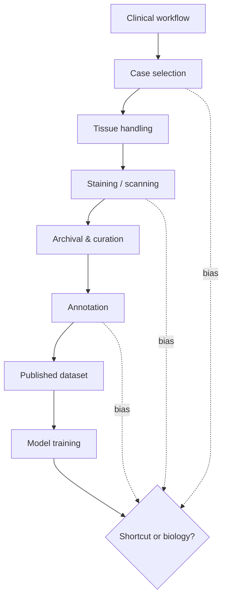

A dataset is usually introduced by its size. In biomedical imaging, size is one of the least interesting things about it.

The interesting things are harder to put in an abstract: who had to be present for the data to exist, what had to be excluded for the labels to be usable, which institutional habits became features, and which kinds of patients never entered the archive in the first place.

When I look at a dataset now, I try to ask not only what it contains, but what had to happen for it to exist.

<aside class="callout callout--key-idea" role="note">

Key idea

A biomedical dataset is not a container of images. It is the residue of a workflow—clinical, technical, and human—and models learn that residue unless we actively disentangle it.

</aside>

## The cost is not only annotation time

Annotation is expensive. That cost is visible. The hidden costs are often larger:

- **Cohort construction:** Who was referred, biopsied, resected, or sequenced—and who was not?
- **Preparation variance:** Fixation time, section thickness, stain batch, scanner settings.
- **Exclusion logic:** Blurry regions removed, slides with insufficient tissue dropped, ambiguous cases deferred.
- **Label provenance:** Report diagnosis, consensus review, single annotator, weak heuristic.

Each step is a decision. Decisions become distributions. Distributions become what the model calls "the data."

See [why annotation quality matters](/blog/small-explainers/why-annotation-quality-matters) for the annotator side. This note is about the upstream pipeline that makes annotation possible—and that constrains what annotation can mean.

<aside class="callout callout--observation" role="note">

Observation

Two datasets with the same organ and task name can encode different diseases in practice—because inclusion criteria, staining protocols, and label definitions differ in ways the README never fully captures.

</aside>

## Missing negatives are a design choice

Biomedical datasets often arrive pre-filtered by clinical urgency. Rare negatives, borderline cases, and post-treatment tissue may be underrepresented—not because the world lacks them, but because the archive was built for a different purpose.

A model trained on such a dataset may appear highly accurate while never having seen the cases that stress the intended use case. The cost of the missing negatives is paid later, during evaluation or deployment—not during dataset construction.

This is one reason I am skeptical of claims that begin with dataset scale. More images of the same workflow do not automatically broaden the biological coverage. They may only sharpen the model's fit to the workflow.

## Weak labels inherit hidden costs

Weak supervision is attractive partly because labels already exist: pathology reports, billing codes, retrospective diagnoses, molecular test results.

But those labels were produced for clinical or operational reasons, not for machine learning. They compress time, context, and uncertainty. A report label may lag the slide. A molecular criterion may define a subclass the H&E image only partially reflects.

[What makes weak supervision difficult](/blog/research-notes/what-makes-weak-supervision-difficult) is about the modeling consequences. The dataset note is about the provenance: weak labels feel free because the cost was paid elsewhere—and often not documented in ML papers.

I am increasingly convinced that dataset documentation is a scientific contribution, not administrative overhead.

<aside class="callout callout--misconception" role="note">

Common misconception

Public datasets are neutral benchmarks. They are frozen snapshots of particular decisions—scanner, site, era, annotation guideline—that may not transfer even to the next hospital in the same city.

</aside>

## Data-centric AI is not only cleaning labels

Data-centric AI is sometimes reduced to fixing mislabeled patches. That matters, but it is the visible tip.

The deeper data-centric question is whether the dataset supports the claim the model will make. If the claim is cross-site generalization, the dataset must contain site diversity—or the claim must shrink. If the claim is morphology sensitivity, the dataset must contain morphology variation—not only quantity.

I think of dataset design as hypothesis design. What world are we asking the model to learn? What world are we pretending exists because the archive made it easy to sample?

## What better dataset practice looks like

I do not expect perfect documentation. I do expect enough documentation that a skeptical reader can reason about failure.

Useful practices include:

- Reporting inclusion and exclusion criteria with numbers
- Documenting stain, scanner, and magnification distributions
- Separating patient, slide, and site identifiers for split design
- Recording annotation guidelines and inter-rater disagreement
- Stating what the dataset is *not* representative of

Papers that do this are easier to trust—even when the numbers are not state of the art. See [what makes a medical AI paper convincing](/blog/research-notes/what-makes-a-medical-ai-paper-convincing).

<aside class="callout callout--lesson" role="note">

Lesson

The cheapest dataset to publish is often the most expensive dataset to learn from—because hidden structure becomes hidden supervision, and the model optimizes it faithfully.

</aside>

## Human cost matters too

Datasets are built by pathologists, technicians, residents, data curators, and patients who did not consent to becoming a benchmark. The human cost is easy to erase in a methods section that lists only image counts.

I am not making a purely ethical point—though it matters. I am making an epistemic one. Annotation fatigue, time pressure, and ambiguous cases shape labels. Those shapes become loss landscapes.

When we treat datasets as interchangeable inputs, we underestimate how much scientific conclusions depend on labor conditions we never measured.[^1]

<aside class="callout callout--research-question" role="note">

Research question

Can we build dataset cards for pathology that are minimal enough to be adopted routinely, yet rich enough to predict which failure modes a model trained on the dataset is likely to inherit?

</aside>

## The useful uncertainty

The hidden cost of biomedical datasets is not a reason to stop using them. It is a reason to stop treating them as transparent containers of biology.

When I look at a dataset now, I try to reconstruct the workflow that produced it. The model will learn that workflow unless the paper proves otherwise.

---

**Something I am still unsure about:** whether multi-institutional datasets actually reduce shortcut learning, or whether they mostly add new site-specific shortcuts while averaging out the ones we already recognize. I would want to see models evaluated on held-out *preparation protocols*, not only held-out sites with similar habits.

[^1]: This is one place where qualitative collaboration with clinicians improves science, not just optics.
