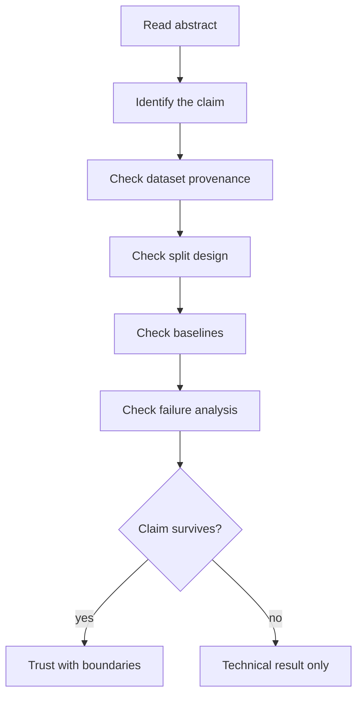

A convincing medical AI paper does not have to be perfect. It does have to make the reader feel that the authors know where the ground is soft.

I mean that literally. The best papers locate uncertainty precisely: in the cohort, in the labels, in the split, in the intended use case, in the gap between patch performance and clinical workflow. The worst papers treat uncertainty as a tone problem—something to wave away in a limitations paragraph after the results section has already made the claim.

The papers I trust most are not the ones that remove all doubt. They are the ones that locate doubt precisely.

<aside class="callout callout--key-idea" role="note">

Key idea

A medical AI paper is an argument, not a model announcement. The architecture is one premise. The dataset, evaluation, and language are the rest.

</aside>

## I read the claim before the method

The method section is easy to get lost in. I try to extract one sentence the authors are asking me to believe:

- The model generalizes across sites.
- The model learns morphology, not shortcuts.
- The model is ready for clinical triage.
- The model reduces annotation cost without sacrificing biology.

Each claim implies a different burden of proof. A paper that claims generalization without site-separated evaluation has not met its own burden. A paper that claims morphology without morphology-sensitive tests has shifted the burden to the reader's optimism.

See [how I read a research paper](/blog/small-explainers/how-i-read-a-research-paper) for the procedural version of this habit. Here I want to focus on what makes the reading end in conviction rather than suspicion.

<aside class="callout callout--observation" role="note">

Observation

Many papers are strongest where they are narrow. A paper that claims a better nucleus detector under stated stain conditions is easier to trust than a paper that claims a step toward clinical-grade diagnosis from a single retrospective cohort.

</aside>

## The dataset is part of the method

A medical AI paper without dataset context is incomplete in a way that no architecture detail can repair.

I want to know:

- Who is in the cohort, and who is missing?
- How were positives defined—pathologist consensus, report label, molecular criterion?
- What preprocessing removed cases, and did exclusions change prevalence?
- Are labels patch-level, slide-level, or inherited from workflow?

This is not pedantry. It is how I decide whether the evaluation tests the claim or merely reproduces the dataset's habits. [The hidden cost of biomedical datasets](/blog/research-notes/the-hidden-cost-of-biomedical-datasets) is about this layer of the argument.

## Evaluation should match the nouns in the abstract

If the abstract says "robust," I look for stain shift, scanner shift, or site shift—not only a random held-out split.

If the abstract says "clinically meaningful," I look for task coherence, error costs, and plausible workflow fit—not only AUC.

If the abstract says "interpretable," I look for what interpretation means operationally—attention maps, counterfactuals, expert review—not only a visualization.

[Why evaluation matters more than another 1% accuracy](/blog/research-notes/why-evaluation-matters-more-than-another-1-accuracy) is the longer version of this instinct. Convincing papers align nouns with measurements.

I have started writing my own papers by drafting the limitations first. It clarifies what the results are actually allowed to say.

<aside class="callout callout--misconception" role="note">

Common misconception

A stronger baseline comparison is not optional generosity—it is part of the claim. If the proposed method only beats a weak or mismatched baseline, the result may be engineering, not evidence.

</aside>

## Failure analysis is not a courtesy

I am suspicious of papers that show only successful predictions. Failure is where the scientific content often lives.

A convincing paper tells me:

- Which subgroups degrade performance
- Whether errors are concentrated in plausible hard cases or arbitrary easy ones
- Whether the model is miscalibrated
- Whether failures would matter in the stated use case

Failure analysis does not have to be exhaustive. It has to be honest enough that I can update my belief about the claim.

## Language is evidence too

Medical AI writing has a predictable inflation curve: assistance becomes decision support becomes clinical-grade becomes transformative. Each step may be unsupported by the experiment.

I trust papers that use language proportional to the evidence. "Promising under these conditions" is a valid conclusion. "Clinically ready" is a different kind of statement—one that requires a different kind of study, often outside the scope of a conference paper.

This is not anti-ambition. It is pro-legibility. When language outruns evidence, reviewers and readers are trained to discount the whole paper—including the parts that are actually solid.

<aside class="callout callout--takeaway" role="note">

Takeaway

Convincing papers make it easy to say what would falsify the claim. If nothing in the evaluation could change the author's mind, the paper is not arguing—it is announcing.

</aside>

## A personal checklist

When I finish a paper, I ask:

1. What is the narrowest true claim the results support?
2. Did the split design test that claim or a easier one?
3. Are baselines fair for the supervision and task?
4. Does failure analysis change how I interpret the headline metric?
5. Does the limitations section contradict the abstract?

If 1 and 5 disagree, I trust 1.

<aside class="callout callout--paper-insight" role="note">

Paper insight

The most reusable papers are often those that report negative or mixed results with clear assumptions. They teach the field where not to spend another year.

</aside>

## The useful uncertainty

I do not have a scoring rubric that separates convincing from unconvincing papers with mechanical certainty. Research taste still matters. But taste can be disciplined.

The papers I return to are the ones that treat evidence as alignment: claim, data, evaluation, and language pointing in the same direction—or explicitly explaining where they diverge.

---

**Something I am still unsure about:** whether the field needs formal "claim labels" in paper abstracts—stating intended use, evidence level, and generalization scope in a standardized way—or whether that would just become another checkbox. I am tempted by the idea because it would make overclaiming easier to spot, but I worry about cosmetic compliance.
