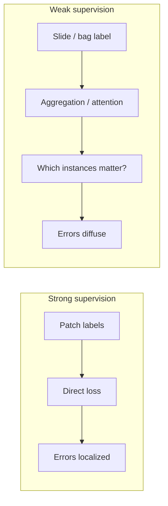

Weak supervision is often introduced as a pragmatic compromise: use cheap labels when expensive labels are unavailable. That description is true, but too polite.

The real difficulty is not that labels are weak. It is that weak labels move ambiguity from the dataset into the learning problem—and then invite us to pretend the ambiguity was resolved by a higher validation score.

Weak supervision is difficult because the model is not the only thing learning. We are also learning what our labels meant in the first place.

<aside class="callout callout--key-idea" role="note">

Key idea

Weak supervision changes where uncertainty lives. With dense labels, ambiguity is partly exported to annotators. With weak labels, ambiguity becomes an explicit modeling obligation.

</aside>

## Weak labels are not just incomplete labels

A slide-level diagnosis does not tell you which patches matter. A case-level outcome does not tell you which cells drove the outcome. A heuristic label from an existing pipeline encodes institutional habit as much as biology.

These labels are useful. They are also coarse in a structured way. The coarseness is not random noise alone—it reflects how clinical and operational workflows compress evidence.

See [what is weak supervision](/blog/small-explainers/what-is-weak-supervision) for definitions. This note is about why the definitions matter: each weak label type creates a different inverse problem. The model must infer what the label saw without being told where it looked.

<aside class="callout callout--observation" role="note">

Observation

In multiple-instance learning, a correct slide-level prediction can be produced for the wrong reason—attention on artifact, stroma, or the easiest tumor focus rather than the diagnostically decisive region.

</aside>

## The aggregation problem is the scientific problem

Most weakly supervised pathology methods introduce aggregation: attention, pooling, graph structure, or latent variable models that decide which parts of a slide support the label.

That mechanism is not an implementation detail. It *is* the scientific claim.

If attention highlights plausible tumor regions on held-out slides, we may believe the model is learning pathology. If attention highlights pen marks, folded tissue, or the densest eosinophilic area, we should revise the claim—regardless of AUC.

CLAM is a useful example because it makes uncertainty visible rather than decorative. My paper note on [CLAM and admitted uncertainty](/blog/paper-notes/clam-weak-supervision-works-best-when-it-admits-its-own-uncertainty) is really about this: weak supervision works best when the method shows what it does not know.

## Weak supervision amplifies shortcut risk

Shortcuts are always a risk in medical imaging. Weak supervision can make them harder to detect.

When labels are dense, errors are localized. When labels are coarse, the model may satisfy the loss by finding any sufficiently predictive proxy anywhere in the bag. The proxy may be staining, necrosis, immune density, or tissue quantity—features that correlate with slide labels in a given cohort for reasons that do not generalize.

This is why weakly supervised papers need stronger evaluation, not weaker evaluation. Slide-level accuracy is insufficient. I want:

- Region-level plausibility checks
- Site-separated testing
- Cases where the weak label is known to be ambiguous
- Comparisons that isolate whether performance survives label noise

I still don't know how much expert review of attention maps should count as evidence. Plausible is not the same as correct.

<aside class="callout callout--misconception" role="note">

Common misconception

Weak supervision is primarily a label-efficiency trick. In pathology, it is often a statement about where evidence lives on the slide—and that statement can be wrong.

</aside>

## Noise is not always symmetric

Weak labels can be wrong in structured ways. A slide labeled negative may contain rare positive foci. A slide labeled positive may reflect a sampling bias in which region was reviewed. A label inherited from a clinical report may encode timing, treatment history, or resection margin status that the image alone does not fully determine.

Treating weak labels as i.i.d. noise misses the point. The noise has a provenance. Methods that ignore provenance may fit the training distribution beautifully and fail on the first cohort where label semantics shift.

This connects to [the hidden cost of biomedical datasets](/blog/research-notes/the-hidden-cost-of-biomedical-datasets). Weak labels are often cheap because someone else already paid the cost of producing them—under constraints the modeling paper never documents.

## What makes a weak supervision method credible

I look for the same things I look for in strongly supervised work, plus a few extras:

- **Explicit linkage:** How does a coarse label connect to fine-grained predictions?
- **Identifiability:** What would make the linkage fail?
- **Negative controls:** Cases where the weak label should not be recoverable from image alone
- **Failure maps:** Where attention or pseudo-labels collapse

A method that only reports slide-level metrics without interrogating localization is asking me to trust aggregation I cannot see.

<aside class="callout callout--lesson" role="note">

Lesson

Do not evaluate weak supervision as if it were strong supervision with fewer pixels. The evaluation must test whether the model found the evidence the weak label implied—not whether it found any evidence.

</aside>

## Relationship to sparse supervision

Weak supervision and sparse supervision overlap but are not identical.

Sparse supervision may still be strong at the patch level—center points are sparse but local. Weak supervision is often coarse at the level where predictions must ultimately make sense. Methods like ShadoNet sit in between: relatively cheap local signals with morphology-aware structure filling in what the labels omit.

See [why pixel-perfect labels aren't always necessary](/blog/research-notes/why-pixel-perfect-labels-arent-always-necessary) for the sparse side of this design space. The difficulty in both cases is alignment between what the label says and what the biology requires.

<aside class="callout callout--research-question" role="note">

Research question

Can we formalize when weak labels are *identifiable* from image data alone—and when they require external structure (spatial priors, temporal context, molecular data) to be learnable without shortcutting?

</aside>

## The useful uncertainty

Weak supervision is not difficult because labels are missing. It is difficult because the missingness is informative. It tells us that evidence was compressed—and the model must decompress it without being given the dictionary.

I do not think the answer is to avoid weak labels. Clinical reality is full of them. The answer is to stop treating aggregation as a black box and start treating it as the hypothesis under test.

---

**Something I am still unsure about:** whether attention-based explanations in weakly supervised MIL can ever be sufficient evidence of localization, or whether they are always at risk of being post-hoc stories unless paired with independent region-level validation. I suspect the latter—but I want to see studies where attention is deliberately stress-tested, not merely illustrated.
