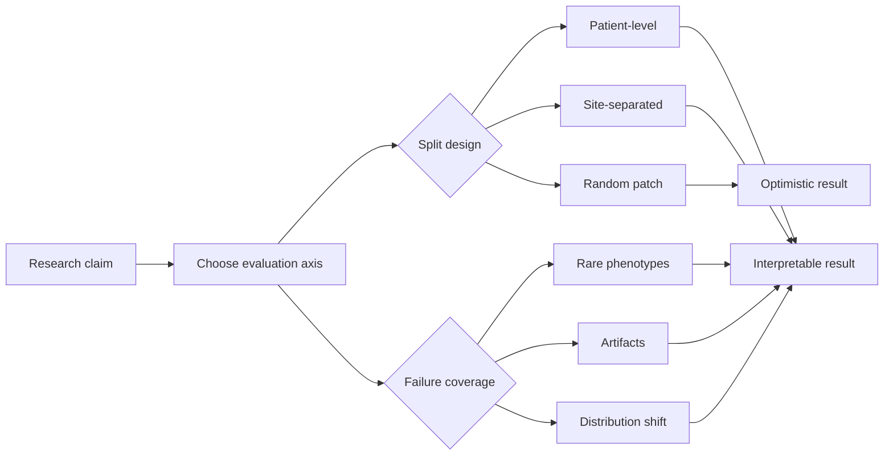

There is a familiar kind of result table where the important sentence is hidden in the split, not in the score.

The model improves by 1.2 points. The abstract mentions robustness. The methods section mentions patient-level partitioning—sometimes. The discussion claims clinical potential. But the real story is often elsewhere: in which cases got easier, which shortcuts survived, and whether the test set ever contained the failure modes the method is supposed to address.

I have started to think of evaluation as the part of the paper that reveals what the authors believe they built. The metric is a number. The evaluation design is an argument.

A metric should be a measurement instrument, not a trophy.

<aside class="callout callout--key-idea" role="note">

Key idea

A small accuracy gain is only meaningful when the evaluation tells us what kind of difficulty the model survived—and what kind of failure it still owes us an explanation for.

</aside>

## The split is part of the result

In biomedical imaging, leakage is not always obvious. Patches from the same slide are not independent. Slides from the same patient are not independent. Slides processed in the same batch, scanned on the same instrument, or collected at the same site may share structure that has little to do with the biology under study.

A model evaluated with random patch splits can look excellent because it is recognizing scanner texture, staining batch, or institutional habit. The 1% improvement may reflect better exploitation of that leakage—not better sensitivity to the target phenomenon.

This is not a niche concern. It is one of the most common ways technically competent work becomes scientifically hard to interpret. See also [what makes a medical AI paper convincing](/blog/research-notes/what-makes-a-medical-ai-paper-convincing) for how I read papers when the headline number and the evaluation design tell different stories.

<aside class="callout callout--observation" role="note">

Observation

Two papers can report nearly identical AUC on the same dataset and mean opposite things—if one used patient-level held-out test sets and the other used random tiles from the same slides.

</aside>

## Metrics answer the question you give them

Accuracy, Dice, F1, AUC—each metric imagines a different failure cost. In pathology, the relevant failure is rarely symmetric.

Missing a rare but consequential morphology is not the same as mislabeling abundant background. Over-segmenting touching nuclei may be harmless for one task and catastrophic for another. A high Dice score on easy regions can coexist with systematic failure on clinically ambiguous boundaries.

This is why I am skeptical of leaderboard logic in medical imaging. A leaderboard assumes the task is stable, the metric is sufficient, and the dataset is representative. In practice, the task drifts, the metric hides stratified failure, and the dataset encodes a particular workflow.[^1]

For imbalanced settings, the choice between accuracy and F1 is not cosmetic. I wrote a short explainer on [why F1 can be more informative than accuracy](/blog/small-explainers/why-f1-is-better-than-accuracy-for-imbalanced-data) when positives are rare and false negatives carry disproportionate weight.

## Evaluation should be designed around failure

The most informative experiments are often not the ones that maximize the headline number. They are the ones that make failure visible.

I care about:

- **Error stratification:** Do mistakes cluster by site, stain, tissue type, or artifact density?
- **Calibration:** Is the model confident where it is wrong?
- **Rare phenotype behavior:** Does performance collapse on the cases the method claims to help?
- **Morphology-specific stress tests:** Does the model preserve the distinction the biology requires?

This connects directly to [morphology before accuracy](/blog/research-notes/morphology-before-accuracy). If a method claims to learn morphology, the evaluation should include morphology—not only a scalar overlap score on a held-out split.

I still don't know how to make failure analysis routine without turning every paper into a atlas of caveats. But skipping it is worse.

<aside class="callout callout--misconception" role="note">

Common misconception

External validation is not a magic stamp. An external set from a similar workflow may only test a slightly different sample of the same shortcut. Site-separated evaluation is stronger when sites differ in acquisition, not just in patient ID.

</aside>

## Clinical meaning is not the same as clinical deployment

Not every research model should be evaluated as if it were entering a hospital next quarter. But even early-stage work can be evaluated with clinical coherence: Does the task match a plausible use case? Does the error analysis reference the kind of cases a pathologist would worry about? Does the paper distinguish triage, measurement support, discovery, and diagnosis?

The research question [what makes an evaluation clinically meaningful](/blog/research-questions/what-makes-an-evaluation-clinically-meaningful) is useful because it forces this distinction. Clinical meaning is contextual. A quality-control model and a biomarker discovery model should not be evaluated as if they share the same notion of success.

## What a stronger evaluation looks like

I do not have a universal checklist. But papers that teach me something usually do several of the following:

- State the claim narrowly enough that failure is possible.
- Use splits that respect patient, slide, or site structure when appropriate.
- Report subgroup behavior, not only aggregate metrics.
- Show examples of failure—not only success cases.
- Compare against baselines that are fair for the claim being made.
- Discuss what the evaluation cannot show.

A 1% improvement with that structure is interesting. A 5% improvement without it often is not.

<aside class="callout callout--takeaway" role="note">

Takeaway

Do not evaluate what you did not intend to learn. If the paper claims robustness, the test set must contain the variation robustness requires. If it claims morphology, the evaluation must interrogate morphology.

</aside>

## The useful uncertainty

I do not think the answer is to abandon summary metrics. Aggregates are necessary. The problem is when they become the entire evidential story.

The extra percentage point is mostly decoration when the instrument measuring it is weak. Evaluation design is how we turn performance into understanding—or at least into an honest account of what remains unknown.

---

**Something I am still unsure about:** whether we can build evaluation suites for pathology that are standardized enough to compare methods fairly, yet diverse enough to surface shortcut learning. My instinct is that the suite has to include deliberately adversarial strata—stain shift, scanner shift, rare morphology—not only a larger version of the training distribution.

[^1]: Leaderboards are useful for engineering progress. They are dangerous when treated as scientific consensus.
