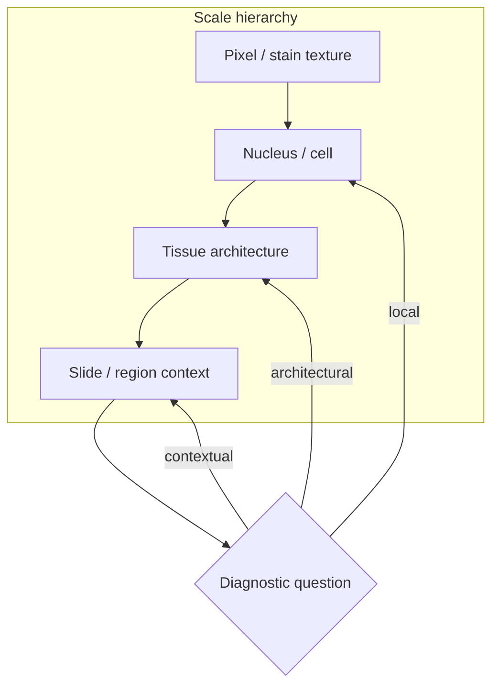

It is tempting to treat pathology as a high-resolution version of computer vision. The temptation is understandable. The images are still RGB tensors. The architectures still convolve. The benchmarks still report accuracy.

It is also dangerous.

The answer often lives between scales, not inside a single patch.

Pathology images are not merely bigger. They are organized differently—in space, in process, and in meaning. Methods imported from natural images can appear to work while ignoring the structures that carry diagnostic significance.

<aside class="callout callout--key-idea" role="note">

Key idea

Histology has a different relationship between pixels, objects, context, and meaning than natural images do. Scale is not a zoom level; it is often part of the diagnosis.

</aside>

## Objects are not independent things

In natural images, objects often have recognizable boundaries: a dog, a car, a cup. In histology, the object of interest may be partially sectioned, densely packed, or defined relationally.

A nucleus may be cut by the plane of section. A gland may matter because of its shape relative to neighboring stroma. A region may be diagnostically important not because every pixel belongs to one class, but because the *arrangement* of cells suggests a process—inflammation, invasion, regression, treatment effect.

This is why I am cautious about methods that assume clean instance segmentation is the default pathology task. Sometimes it is. Often the biology lives in overlap, context, and texture gradients that do not reduce cleanly to object masks.

See [what makes histopathology challenging](/blog/small-explainers/what-makes-histopathology-challenging) for a more entry-level version of this argument. The research note here is the same intuition with sharper stakes: the wrong task definition imports the wrong success metric.

## Magnification is part of the question

A whole-slide image is not one image. It is a pyramid of views at different effective magnifications. A pattern visible at 4× may be invisible at 40×, and vice versa.

Natural-image pipelines often resize to a standard input and move on. Pathology pipelines that do the same risk collapsing the scale structure that pathologists use routinely. Immune infiltrate, tumor budding, necrosis, and stromal reaction each have characteristic scale signatures.

Papers like HIPT make this hierarchy explicit—see my note on [histology's natural scale hierarchy](/blog/paper-notes/hipt-histology-has-a-natural-scale-hierarchy). Whether or not one adopts that architecture, the underlying point stands: pathology models need a theory of scale, not only a theory of patches.

<aside class="callout callout--observation" role="note">

Observation

A model trained at fixed magnification can excel on patch benchmarks and fail on slide-level questions that require integrating context across magnifications. The patch score is not a proxy for the clinical question.

</aside>

## Stain and preparation are visual variables

Natural images vary in lighting. Histology varies in staining chemistry, fixation, section thickness, tissue handling, and scanner processing. These are not nuisances at the margin. They are dominant sources of visual variation.

A model can learn stain intensity as if it were biology. It can learn scanner sharpening as if it were nuclear texture. These shortcuts are extremely plausible because they correlate with labels in real datasets—not because the model is misbehaving, but because the dataset encodes workflow.

This is one reason pathology foundation models require a different evaluative mindset than ImageNet transfer. Scale alone does not wash out preparation effects. See [foundation models are powerful, but not magic](/blog/research-notes/foundation-models-are-powerful-but-not-magic).

## Context changes the label

In natural images, context helps recognition: a boat on water, a chair in a room. In pathology, context can change whether a local pattern is benign or worrisome.

The same nuclear atypia reads differently at the edge of an artifact, inside necrosis, or within an inflamed stroma. The same immune infiltrate pattern may be reactive or clinically significant depending on architecture elsewhere on the slide. Patch-only labels often strip that context away.

I keep returning to this: a label on a patch is a claim about a patch, not necessarily about the slide.

Weak supervision methods—slide labels, multiple-instance learning, attention pooling—exist partly because the relevant evidence is distributed. The difficulty is not only algorithmic. It is definitional: what does the label attach to?

<aside class="callout callout--misconception" role="note">

Common misconception

Transferring a natural-image backbone and fine-tuning on pathology patches does not automatically produce a pathology model. It produces a natural-image feature extractor adapted to patch-level labels—which may or may not encode tissue structure.

</aside>

## Artifacts are part of the domain

Folded tissue, air bubbles, pen marks, out-of-focus regions, crushed cells, and incomplete sections are not edge cases. They are routine.

Natural-image datasets often filter or ignore corruption. Pathology models that have never seen realistic artifact diversity may fail in deployment-like settings while appearing robust on curated benchmarks. Evaluation should include artifact-heavy strata—not as an afterthought, but as part of the domain definition.

## What this means for method design

I do not think pathology requires abandoning modern computer vision. It requires renegotiating the defaults:

- **Task:** Is the target local, architectural, or contextual?
- **Scale:** Which magnifications carry the evidence?
- **Supervision:** Do labels match the scale of the question?
- **Evaluation:** Does the test set stress preparation variation and rare morphology?

This connects to [morphology before accuracy](/blog/research-notes/morphology-before-accuracy). The visual grammar of tissue is not ornamental. It is the substrate of what we want models to respect.

<aside class="callout callout--research-question" role="note">

Research question

Can we define pathology benchmarks where success requires cross-scale reasoning—not only strong performance on fixed-magnification patches?

</aside>

## The useful uncertainty

Pathology is not difficult only because the images are huge. It is difficult because the answer often lives between scales, between cells, and between preparation artifacts and true tissue signal.

I do not know the right universal architecture for that reality. I suspect the right answer is task-specific alignment: the right scale, the right supervision, and the right evaluation for the biological claim—not a single patch classifier scaled up until it sounds impressive.

---

**Something I am still unsure about:** whether explicit multi-scale architectures are necessary, or whether large enough models with naive patch sampling eventually learn scale relationships implicitly. I would want to compare them on tasks where the diagnostic evidence is *known* to require cross-scale integration—not on patch classification alone.
