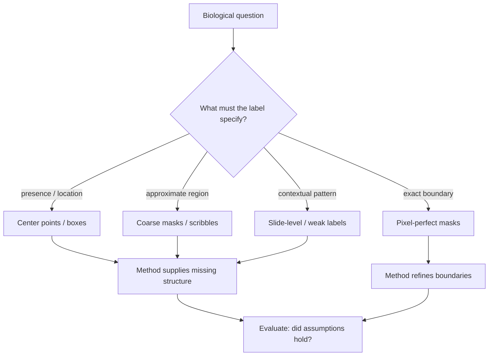

Pixel-perfect labels are comforting because they look like certainty. In pathology, that comfort can be expensive, slow, and sometimes misleading.

A dense mask suggests that the task is fully specified: every pixel has an owner, every boundary has a decision. But the biological phenomenon may not live at pixel resolution. The diagnostically relevant structure may be presence, density, arrangement, or texture—and a mask can over-specify the question while under-representing the uncertainty a pathologist actually holds.

The question I keep returning to is not how little annotation we can get away with. It is what kind of annotation preserves the biological question.

<aside class="callout callout--key-idea" role="note">

Key idea

Label resolution and label relevance are different questions. A dense mask can be irrelevant to the biological phenomenon; a sparse center point can be exactly right.

</aside>

## Not every pathology task is a boundary problem

Segmentation is the default ambition in biomedical imaging—for good reason. When the goal is to measure boundary irregularity, quantify invasive front geometry, or segment overlapping glands, pixel ownership matters.

But many tasks are not boundary problems. Counting. Detection. Identifying whether a structure is present. Learning a representation sensitive to nuclear size or chromatin texture. Ranking regions for review. In these settings, forcing annotators to draw exact edges may add labor without adding information the downstream task can use.

This is the core argument in [morphology before accuracy](/blog/research-notes/morphology-before-accuracy), stated from the annotation side: the label format is a hypothesis about what matters.

<aside class="callout callout--observation" role="note">

Observation

Two annotators may agree that a nucleus is present and disagree on its exact contour. A center point captures the agreement; a mask encodes the disagreement as noise.

</aside>

## Sparse labels demand explicit assumptions

A sparse label is not a cheap label in the intellectual sense. It may be cheaper to collect, but it demands more care from the method.

A center point says an object exists near a location. It says much less about area, contour, overlap, and local uncertainty. That can be enough for counting, detection, or representation learning—especially when the downstream question depends on presence and morphology rather than pixel ownership. It is not enough if the goal is high-precision boundary measurement.

When we use sparse labels, we must model what the label omits: shape priors, consistency losses, morphology-guided representations, uncertainty-aware objectives. Each choice is a scientific statement. See [center points vs. segmentation masks](/blog/small-explainers/center-points-vs-segmentation-masks) for a direct comparison of what each format encodes.

  

    
Sparse annotation

    

      
Cheaper to collect, harder to justify. Forces the method to state assumptions about shape, overlap, and ambiguity. Best when the task tolerates unspecified boundaries.

    

  

  

    
Dense annotation

    

      
Expensive to collect, tempting to over-trust. Encodes boundary decisions and tool conventions. Best when exact delineation is part of the biological question.

    

  

## When pixel-perfect labels are still necessary

I am not arguing against dense annotation. I am arguing against treating it as the default moral choice.

Pixel-perfect labels remain necessary when:

- The measurement *is* the boundary—irregularity, perimeter, invasive depth.
- Small boundary errors change the scientific conclusion.
- The evaluation metric is pixel-level and the claim is pixel-level.
- Ambiguity must be represented, not smoothed away by a coarser format.

Pretending otherwise moves error into evaluation. A model trained on sparse labels and evaluated with dense metrics is being asked to solve a problem the supervision did not define.[^1]

Sparse supervision is not an excuse to skip evaluation rigor. It is a reason to align evaluation with what the labels actually said.

<aside class="callout callout--misconception" role="note">

Common misconception

Weaker labels always mean worse performance. Sometimes they do—but the more subtle failure is high performance via shortcuts that correlate with sparse labels while ignoring intended morphology.

</aside>

## The failure mode is not always lower accuracy

The obvious fear is that sparse labels produce worse models. That is sometimes true.

The failure mode that worries me more is quiet misalignment: the model learns staining intensity, easy-to-detect cell types, or scanner texture because those features predict the sparse label well enough. The score goes up. The intended biology does not.

This is why evaluation must be designed around failure—see [why evaluation matters more than another 1% accuracy](/blog/research-notes/why-evaluation-matters-more-than-another-1-accuracy). A sparse-label paper should show where sparsity helps, where it hurts, and what assumptions make it possible.

## Annotation as a design variable

I am drawn to methods that treat annotation as a design variable rather than a budget constraint alone.

Instead of beginning with the most detailed label and trying to afford it, we can begin with the phenomenon and ask what supervision would make the model sensitive to it. The label, the loss, the architecture, and the evaluation should form a coherent argument.

A practical version: do not annotate what you cannot evaluate, and do not evaluate what you did not intend to learn.

<aside class="callout callout--research-question" role="note">

Research question

Can morphology-aware objectives recover boundary-relevant structure from center-point supervision for tasks where exact masks were never collected—or do they only work when the missing boundary was never biologically necessary?

</aside>

The open question [can morphology replace large annotated datasets](/blog/research-questions/can-morphology-replace-large-annotated-datasets) sits on this boundary. "Replace" is too strong a word. "Substitute for specific missing information under stated assumptions" is closer to what I think is achievable.

## The useful uncertainty

There are tasks where pixel-perfect labels are not only useful but necessary. There are also tasks where dense masks create a false sense of rigor because the exact pixels matter less than the structure they approximate.

The more I work in this area, the more I think annotation should be treated as part of the hypothesis—not a neutral input, not a virtue signal, not a universal requirement.

---

**Something I am still unsure about:** how to decide *before* training whether a given downstream task will tolerate sparse supervision—or whether that tolerance can only be diagnosed retrospectively through failure analysis. I want a decision framework grounded in task geometry, not annotation budget alone.

[^1]: Mismatch between supervision format and evaluation metric is one of the most avoidable sources of overclaiming in biomedical imaging papers.
