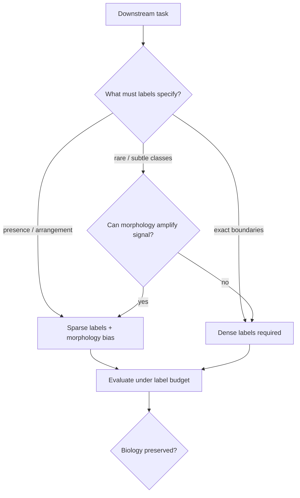

Can morphology replace large annotated datasets?

I do not know the answer. That is why the question is useful.

"Replace" is probably the wrong verb. "Substitute for specific missing information under stated assumptions" is closer to what I think might be achievable.

Dense biomedical labels are expensive, inconsistent, and sometimes mismatched with the biological question. Morphology-aware methods promise structure that labels would otherwise supply—shape priors, consistency losses, weak-to-strong pipelines, foundation model representations tuned to tissue organization.

The promise is real. The word *replace* is where the trouble starts.

<aside class="callout callout--key-idea" role="note">

Key idea

Morphology can supply inductive bias. It cannot supply ground truth. The question is when bias and sparse signal are enough—and when only explicit annotation can define the target.

</aside>

## Why the question is seductive

Annotation bottlenecks are genuine. Whole-slide pathology magnifies them. If morphology-aware learning could reduce dependence on pixel-perfect masks without sacrificing the biological target, the practical impact would be large.

I am invested in this possibility—ShadoNet sits in this design space. But investment is a reason for skepticism, not for softer evaluation.

The seductive version of the question asks: *how little annotation can we get away with?* The better version asks: *what kind of annotation preserves the biological question—and what can morphology infer without pretending it was observed?*

See [morphology before accuracy](/blog/research-notes/morphology-before-accuracy) and [why pixel-perfect labels aren't always necessary](/blog/research-notes/why-pixel-perfect-labels-arent-always-necessary).

<aside class="callout callout--observation" role="note">

Observation

Center-point supervision can train useful nucleus models—not because points are magic, but because many downstream tasks depend on presence and approximate location more than exact pixel ownership.

</aside>

## Morphology is not one thing

The question becomes difficult immediately because *morphology* spans shape, texture, architecture, neighborhood context, and developmental state. A method that encodes nuclear roundness does not automatically encode gland formation or immune exclusion patterns.

Morphology-aware objectives are specific scientific statements. They say: this aspect of structure is stable enough to act as supervision. That statement can be wrong—especially across tissue types, stains, or disease stages.

In ShadoNet week 2 I compared center annotations to masks—not to declare a winner, but to make the supervision hypothesis explicit.

See [center annotations vs. segmentation masks](/blog/building-shadonet/week-2-center-annotations-vs-segmentation-masks) for how I approached that comparison in practice.

## When morphology might substitute for labels

I think morphology-aware learning has a plausible role when:

- The task tolerates unspecified boundaries (detection, counting, coarse segmentation)
- The biological signal lives in arrangement or texture, not exact edges
- Sparse labels anchor presence while the method models shape
- Evaluation tests morphology-sensitive failure modes—not only overlap scores

In these settings, morphology does not *replace* labels. It fills in what sparse labels deliberately omit—under assumptions the paper must state.

<aside class="callout callout--misconception" role="note">

Common misconception

Fewer labels always mean a weaker scientific claim. Sometimes sparse labels plus explicit morphology assumptions produce a stronger claim—because the paper admits what was not observed.

</aside>

## When morphology cannot replace labels

There are tasks where approximate structure is not enough:

- Boundary irregularity as the measured endpoint
- Legal or clinical definitions tied to exact extent
- Subtle class differences carried at the pixel level
- Rare morphologies where priors trained on common shapes fail silently

Here, morphology-aware losses may still help as regularization. They do not eliminate the need for labels that define the target.

## What evidence would move me?

A useful answer requires controlled evaluation across label budgets—not one heroic sparse-label result.

I would want to see:

- **Matched annotation cost:** Compare dense, sparse, and morphology-augmented regimes at equal annotator time
- **Task stratification:** Where sparsity wins, where it ties, where it fails catastrophically
- **Cross-tissue tests:** Whether morphology priors transfer or reintroduce shortcut bias
- **Negative controls:** Tasks where morphology should not help—if it does, suspect shortcuts

<aside class="callout callout--failure" role="note">

Failure mode

Morphology-aware methods that improve metrics on easy regions while degrading performance on overlapping or ambiguous structures—the cases where dense labels would have carried real information.

</aside>

## Relationship to foundation models

Large pretrained encoders change the tradeoff. They may supply generic tissue structure that reduces the need for dense labels on some tasks. They may also supply generic shortcuts that make sparse-label performance look deceptively good.

[Foundation models are powerful, but not magic](/blog/research-notes/foundation-models-are-powerful-but-not-magic). Pretraining is not a substitute for asking what the labels needed to say.

## A boundary around the question

I want to reject the fantasy version: morphology eliminates annotation, experts become optional, and scale solves pathology.

The bounded version: morphology-aware learning can reduce *certain kinds* of annotation for *certain tasks* when *certain assumptions* hold—and those assumptions must be evaluated, not assumed.

## The useful uncertainty

My tentative belief is that morphology will not replace large annotated datasets globally. It will change the annotation portfolio: fewer pixels where boundaries are not the phenomenon, more expert time where ambiguity is biologically load-bearing.

The question stays open because we lack systematic label-budget studies that report failure—not only efficiency wins.

---

**Future experiment I would actually run:** fix an annotator-hour budget, allocate it across center points, coarse regions, and full masks under different morphology-aware training regimes, and evaluate on a task suite that includes both boundary-sensitive and arrangement-sensitive endpoints. The output should be a map of where morphology substitutes for labels—not a single ratio claiming 90% savings.
