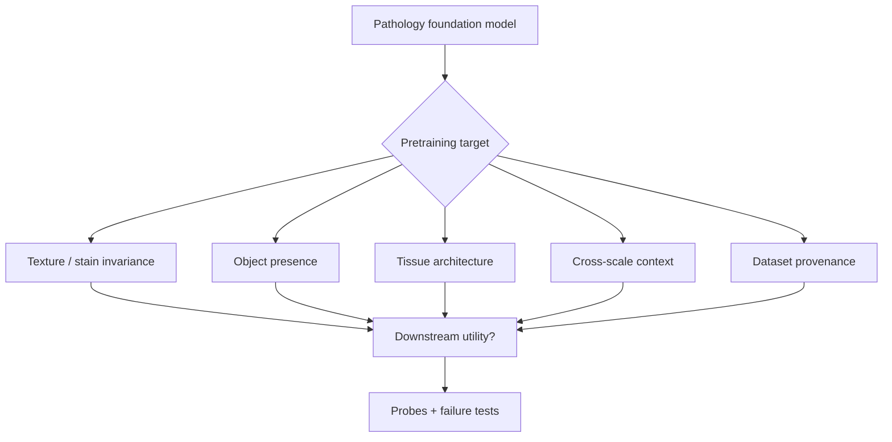

What should pathology foundation models actually learn?

I do not know the answer. That is why the question is useful.

Large models are becoming central to pathology research, but usefulness depends on what their representations encode—not how many parameters they have.

The field has converged on a default recipe: collect many whole-slide patches, pretrain with a self-supervised or multimodal objective, fine-tune on downstream tasks, report improved metrics. The recipe works often enough to keep us using it. It does not tell us what the representation *should* optimize for.

<aside class="callout callout--key-idea" role="note">

Key idea

Pretraining needs a target. "More data" is a resource strategy, not a scientific answer to what structure a pathology representation ought to preserve.

</aside>

## Why the default answer is unsatisfying

The easy response to any pathology representation question is: more data, more labels, larger models. Sometimes that is correct. But it is incomplete as a research direction.

More data can amplify the wrong signal. More labels can encode the wrong abstraction. Larger models can make shortcuts harder to see—not because shortcuts disappear, but because they become more expressive.

Foundation models in pathology sit on top of all the usual domain difficulties: stain variation, scanner effects, multi-scale structure, weak labels, and cohort bias. See [why pathology is different from natural images](/blog/research-notes/why-pathology-is-different-from-natural-images). Pretraining at scale does not automatically respect those difficulties. It may crystallize them.

## What would make the answer interesting?

The interesting version of this question is not whether a clever method improves a benchmark. It is whether pretraining changes the relationship between annotation, morphology, and evidence.

One possibility: pretraining could learn a reusable visual grammar of tissue—cells, stroma, artifacts, spatial relationships across magnification. If true, the value would not be label efficiency alone. The representation would be aligned with how pathologists organize visual evidence.

Another possibility: pretraining mostly learns dataset provenance—institutional staining, scanner texture, inclusion criteria—and downstream fine-tuning merely adapts those shortcuts to new label sets.

I do not know which outcome is dominant. The field often behaves as if the first is guaranteed. I am not convinced.

<aside class="callout callout--observation" role="note">

Observation

Two encoders with similar fine-tuning performance can differ sharply in frozen embedding probes—one may cluster by tissue type, another by scanner. Downstream metrics alone do not reveal which we built.

</aside>

## What counts as success?

A higher score is not enough. I would want to know whether errors changed in the right direction:

- Less sensitivity to stain variation where biology should be stable
- Preservation of rare morphology under distribution shift
- More honest failure on ambiguous regions
- Useful transfer to tasks that share biological structure but not labels

This is the same instinct behind [foundation models are powerful, but not magic](/blog/research-notes/foundation-models-are-powerful-but-not-magic). Scale is leverage. It is not a substitute for specifying the target.

I do not want to claim morphology-aware learning in general. I want to say which morphology, through which labels, under which failures.

## Where the question becomes difficult

The obstacle is vocabulary. We say *morphology*, *understanding*, *robustness*, and *clinical meaning* as if the words define the target. They do not.

Each term needs an operational form:

- **Morphology** might mean nuclear shape in one project and gland architecture in another.
- **Robustness** might mean scanner shift, stain shift, site shift, or annotation shift.
- **Usefulness** might mean triage, QC, measurement support, or discovery.

For my own work, the reminder is to keep the noun attached to the task. Foundation model papers that claim generality without probes are asking me to trust a black box with better baselines.

<aside class="callout callout--misconception" role="note">

Common misconception

Self-supervised pretraining is objective-neutral. The objective—contrastive, masked reconstruction, multimodal alignment—encodes assumptions about what variation should be ignored and what structure should be preserved.

</aside>

Papers like DINO and MAE are instructive here—not because any one objective is the answer, but because they make the assumption visible. See my notes on [DINO and structure before labels](/blog/paper-notes/dino-representation-learning-can-expose-structure-before-labels-arrive) and [MAE and meaningful missingness](/blog/paper-notes/mae-reconstruction-is-useful-only-when-the-missingness-is-meaningful).

## What evidence would move me?

I would be moved by studies that distinguish biological structure from acquisition shortcuts—using probes, not only fine-tuning:

- Frozen embedding analysis before task labels enter
- Cross-site and cross-stain evaluation with matched biology
- Downstream tasks that share structure without sharing labels
- Negative results where pretraining hurts or adds nothing

Negative results matter. Not every foundation model should transfer. Not every pretraining corpus should define the field's default encoder.

<aside class="callout callout--experiment" role="note">

Future experiment

Pretrain matched encoders on the same patch corpus with different objectives, then evaluate with a fixed probe battery: tissue type, scanner ID, stain batch, nuclear density, architectural class—without fine-tuning on those tasks.

</aside>

## A boundary around the question

I want to keep this question from becoming so large that every answer is vague.

The goal is not to solve medical AI in general. It is not to claim one encoder replaces careful annotation, expert review, or external validation. The goal is to identify what pretraining should optimize for—in pathology specifically—so that "foundation model" means something more than "large and pretrained."

That boundary turns uncertainty into something studiable.

## The useful uncertainty

Right now, my tentative belief is that the answer will not be a single method. It will be a set of alignments: the right objective for the right biological structure, the right scale for the right task, and the right evaluation for the right claim.

The question remains open because it keeps me from confusing technical progress with scientific understanding. I want models to perform well. I also want to know what their representations mean before fine-tuning hides the evidence.

---

**Hypothesis I would want to test:** pathology foundation models pretrained with objectives that explicitly respect multi-scale structure—rather than patch-only invariance—will show better transfer to architectural downstream tasks, even when patch-level classification metrics are similar. I do not know if that is true. It is specific enough to fail.
