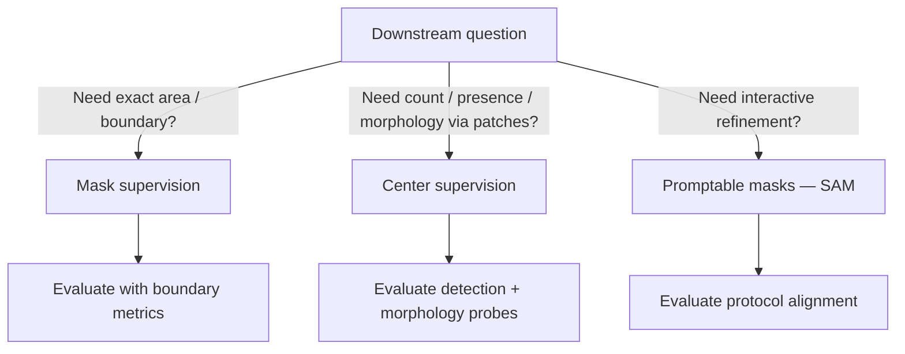
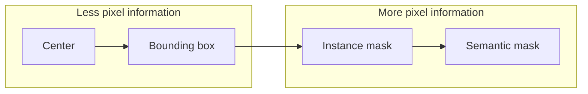

Center points and segmentation masks are not two qualities of the same label. They are **two different scientific statements about what the model is allowed to know about an object.**

Definition

Center-point annotation

A label that marks a single coordinate (or small region) as indicating object presence—typically near the object centroid. It asserts <em>that</em> an object exists and <em>roughly where</em>, not <em>which pixels belong to it</em>.

Definition

Segmentation mask

A per-pixel label map assigning each pixel to object or background (or to instance IDs). It asserts <em>boundary ownership</em>—including area, shape, and overlap resolution at pixel granularity.

## The basic idea

| | Center point | Segmentation mask |
|---|--------------|-------------------|
| Asserts | Presence + location | Pixel ownership |
| Silent on | Boundary, area, overlap | Nothing at pixel level—if drawn carefully |
| Collection cost | Lower | Higher |
| Ambiguity | Where exactly is "center" for irregular nuclei? | Where is the edge on overlap? |

Center points are not poor masks. They are a different—and sometimes stricter—claim about sufficiency.

<aside class="callout callout--key-idea" role="note">

Key idea

Choose annotation based on what the downstream task needs to <em>know</em>, not on what tools make easiest to draw.

</aside>

## Why it matters in pathology

Nuclei overlap, stain heterogeneity, and partial sectioning make boundaries genuinely hard. A mask drawn in 3 seconds with a large brush teaches a different task than a mask adjudicated by two pathologists.

[Annotation quality](/blog/small-explainers/why-annotation-quality-matters) is about alignment—not density. [Morphology before accuracy](/blog/research-notes/morphology-before-accuracy) argues label resolution ≠ label relevance.

<aside class="callout callout--observation" role="note">

Observation

Sparse center labels can produce better <em>scientific</em> models than dense masks when masks encode the wrong edge convention—while looking more impressive in a qualitative figure.

</aside>

[Segment Anything](/blog/paper-notes/segment-anything-promptability-changes-annotation-but-not-responsibility) blurs the cost line by making masks fast—but not by changing what a mask means.

## Supervision information content

Moving right adds information—and **adds opportunities for protocol error**.

## The common mistake

- Training on centers, evaluating with mask Dice (mismatched target)
- Treating SAM masks as ground truth without SOP review
- Assuming masks are always "stronger" supervision—they are stronger only when boundaries matter for the question

<aside class="callout callout--misconception" role="note">

Common misconception

Center supervision cannot support morphology-aware learning. It can—if the model and losses connect centers to patch-level morphology without pretending centers are mini-masks.

</aside>

See [why pixel-perfect labels aren't always necessary](/blog/research-notes/why-pixel-perfect-labels-arent-always-necessary).

## How I use it

For nucleus work, I ask:

1. Does the clinical or biological question need **area** or **count and appearance**?
2. Can annotators agree on **edges** at acceptable cost?
3. What **probe** validates morphology beyond detection F1?

Building ShadoNet, this choice is week-one material—see [building ShadoNet week 2](/blog/building-shadonet/week-2-center-annotations-vs-segmentation-masks).

## Research question for my own work

**If I switched from masks to centers (or vice versa), what would change in the model's permissible shortcuts—not only in annotation time?**

Diagnostic test: train matched models on centers-only vs. masks on the same images (masks held out for eval only). Compare detection, size distribution error, and boundary-sensitive morphology metrics. If centers match masks on biology-relevant probes but not on Dice, centers may be the higher-quality supervision for the actual question.

Center points and masks answer different questions. Pick the question first.
