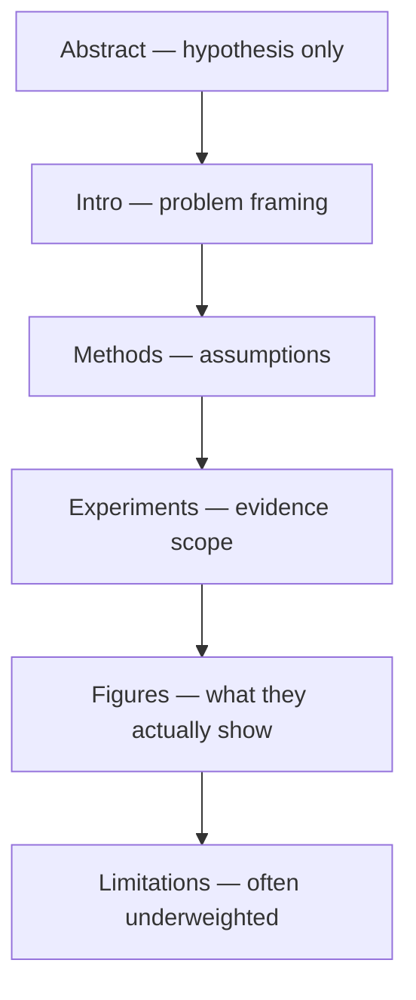

I do not read papers to collect citations. I read to extract **assumptions I can test**—especially in computational pathology, where dataset and evaluation details often matter as much as architecture.

Definition

Assumption-first reading

A reading strategy that treats methods as bundles of claims about data, labels, invariances, and evaluation—asking what must be true for the results to mean what the authors imply.

## The basic idea

Papers contain four layers at once:

1. **Problem framing** (what world the authors think they are in)
2. **Method** (what the model enforces)
3. **Evidence** (what was actually measured)
4. **Rhetoric** (what the authors want you to conclude)

Results live in layer 3. Durable value for my notebook usually lives in layers 1 and 2.

A strong number with a hidden assumption is a weak companion for research design.

<aside class="callout callout--key-idea" role="note">

Key idea

Read for the question the paper makes clearer—not only for the method it introduces. The question survives longer than the SOTA table.

</aside>

## My pass order

**Pass 1 (20 minutes):** Figures, tables, dataset description. Can I tell what was labeled, how, and on what splits?

**Pass 2:** Methods—not line by line, but for **decision points**: augmentation, masking, aggregation, loss weighting, threshold selection.

**Pass 3:** Write one paragraph in my voice: *what idea stayed*, *what caution I carry*, *what test would falsify it in my setting.*

That third pass becomes a [paper note](/blog/paper-notes/simclr-augmentation-is-a-scientific-assumption) or a link from [research notes](/blog/research-notes/what-makes-a-medical-ai-paper-convincing).

<aside class="callout callout--observation" role="note">

Observation

In pathology ML, the difference between a convincing and an unconvincing paper is often external validation and label provenance—not parameter count.

</aside>

## What I highlight in pathology papers

| Question | Why |
|----------|-----|
| Label source | Weak vs. strong supervision ([what is weak supervision](/blog/small-explainers/what-is-weak-supervision)) |
| Pretraining | What invariances were installed ([representation learning](/blog/small-explainers/what-is-representation-learning)) |
| Aggregation | MIL claim or explanation? ([attention MIL](/blog/paper-notes/attention-based-deep-mil-attention-as-an-interface-not-an-explanation)) |
| Metric | Accuracy vs. F1 vs. clinical constraint ([F1 explainer](/blog/small-explainers/why-f1-is-better-than-accuracy-for-imbalanced-data)) |
| Generalization | New hospitals or new splits of same site? |

Definition

External validation

Evaluation on data collected under different protocols, sites, scanners, or time periods than training—intended to test whether performance is tied to institution-specific shortcuts.

## The common mistake

Reading the abstract's conclusion as the paper's content. SOTA claims without checking:

- whether baselines were tuned fairly
- whether "weak supervision" meant slide labels or something else
- whether attention figures are evaluated or decorative

<aside class="callout callout--misconception" role="note">

Common misconception

If I understand the architecture, I understand the paper. Architecture is often the least transferable part—assumptions travel further.

</aside>

## How I use it

Every paper note ends with a **diagnostic test** for my own work (e.g., ShadoNet): what would plausible failure look like?

If I cannot write that test, I have read for vocabulary, not for research.

## Research question for my own work

**After reading, can I name one assumption that—if false in my cohort—would make the method fail quietly?**

Diagnostic test for my reading: explain the paper to a colleague without mentioning the method name—only the assumption and the evidence. If the explanation collapses, I have not read deeply enough yet.

Paper reading becomes research design when assumptions turn into experiments on my desk—not when the PDF moves to a "read" folder.
