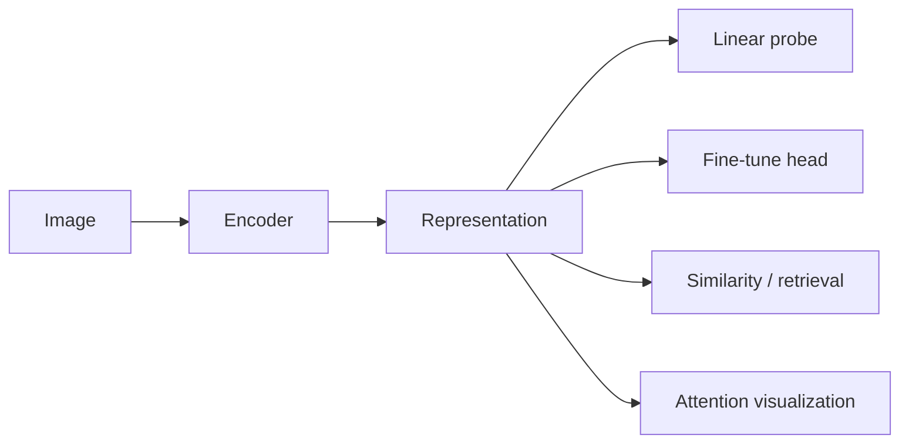
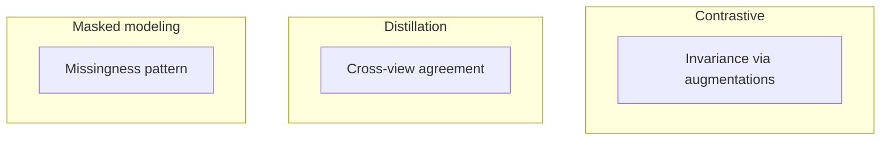

Representation learning is not "better features" in the abstract. It is **training models to produce internal descriptions of data such that many downstream tasks become easier—while encoding assumptions about what should be preserved and what can be ignored.**

Definition

Representation (embedding)

A vector (or structured set of vectors) produced by an encoder that summarizes an input image or patch. Downstream models use representations instead of raw pixels—trading interpretability of inputs for compactness and transfer.

## The basic idea

Instead of hand-crafting features (color histograms, texture filters), we train encoders with objectives that do not require full task labels:

- **Contrastive** ([SimCLR](/blog/paper-notes/simclr-augmentation-is-a-scientific-assumption)): pull augmented views together
- **Distillation** ([DINO](/blog/paper-notes/dino-representation-learning-can-expose-structure-before-labels-arrive)): match teacher-student views
- **Reconstruction** ([MAE](/blog/paper-notes/mae-reconstruction-is-useful-only-when-the-missingness-is-meaningful)): predict masked pixels

Each objective installs different invariances.

A representation is useful relative to a task family—not absolutely.

<aside class="callout callout--key-idea" role="note">

Key idea

Representations should be judged by what they make easier to measure, transfer, and understand—not by pretraining loss alone.

</aside>

## Why it matters in pathology

Histology representations may encode nuclear morphology, tissue compartment, stain intensity, scanner signature, or batch effects—**simultaneously**. Without probing, fine-tuning AUC cannot tell you which.

[HIPT](/blog/paper-notes/hipt-histology-has-a-natural-scale-hierarchy) adds scale structure; [foundation models](/blog/research-notes/foundation-models-are-powerful-but-not-magic) add data scale. Neither removes evaluation obligation.

<aside class="callout callout--observation" role="note">

Observation

Two encoders with similar linear-probe accuracy on tissue type can diverge on stain-shift robustness or nuclear boundary tasks—because they preserved different factors of variation.

</aside>

## Self-supervised objective map

Definition

Linear probe

A lightweight classifier trained on frozen representations to predict a labeled task. Measures how much label-relevant information is already linearly accessible—without full fine-tuning that can hide representation quality.

## The common mistake

Treating " pretrained representation" as a universal substrate:

- pretraining distribution ≠ your scanner/stain
- probe task ≠ clinical task
- emergent attention ≠ pathologist-aligned structure

<aside class="callout callout--misconception" role="note">

Common misconception

Better ImageNet pretraining automatically helps pathology. Transfer depends on whether pretraining invariances align with the morphology your labels require—see [morphology before accuracy](/blog/research-notes/morphology-before-accuracy).

</aside>

## How I use it

Before fine-tuning, I probe:

1. **k-NN / linear** on coarse labels if available
2. **Stain and scanner stratification** of embedding space
3. **Qualitative review** of attention or retrieval neighbors on hard slides

Representation learning saves labels when the representation already encodes what you need. It wastes labels when fine-tuning overwrites emergent structure with shortcuts.

## Research question for my own work

**Does my encoder preserve the factor of variation my task treats as signal—or did pretraining declare it noise?**

Diagnostic test: apply controlled perturbations (stain shift, rotation, blur, mask nuclear boundaries) and measure embedding distance vs. downstream label sensitivity. Large embedding drift on perturbations that do not change clinical labels means the representation is misaligned.

Representations are contracts about invariance. Read the contract before trusting the embedding.
