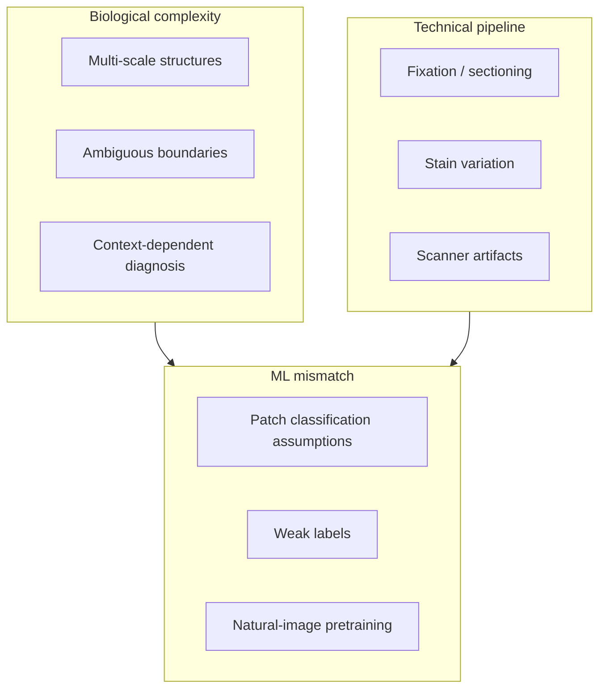

Histopathology is challenging for AI not because the images are "big," but because **meaning is distributed across scale, context, preparation history, and expert judgment**—none of which standard image-classification benchmarks encode by default.

Definition

Histopathology image analysis

The computational analysis of tissue images produced by fixing, sectioning, staining (typically H&E), and digitizing specimens—where diagnostic signal lives in nuclear detail, architectural patterns, and slide-level context simultaneously.

## The basic idea

A whole-slide image (WSI) spans gigapixels. Objects of interest—nuclei, glands, mitoses, immune infiltrates—appear at different magnifications with ambiguous boundaries, overlap, and stain variability. Labels are expensive; weak slide-level labels are common ([what is weak supervision](/blog/small-explainers/what-is-weak-supervision)).

Size is a engineering challenge. Scale, context, and preparation are the scientific challenges.

<aside class="callout callout--key-idea" role="note">

Key idea

Histopathology is hard because the label you have (slide, patch, point, mask) rarely matches the morphology the question requires—across magnifications and labs.

</aside>

## Why it matters for ML design

Methods imported from natural images embed assumptions that may fail:

- **Single-scale encoders** ignore architecture visible only at lower power ([HIPT](/blog/paper-notes/hipt-histology-has-a-natural-scale-hierarchy))
- **Contrastive augmentations** may destroy stain signal ([SimCLR](/blog/paper-notes/simclr-augmentation-is-a-scientific-assumption))
- **Attention heatmaps** are not explanations ([attention MIL](/blog/paper-notes/attention-based-deep-mil-attention-as-an-interface-not-an-explanation))

See [why pathology is different from natural images](/blog/research-notes/why-pathology-is-different-from-natural-images) for the longer argument.

<aside class="callout callout--observation" role="note">

Observation

Two models with the same WSI AUC can rely on different evidence: one on nuclear pleomorphism, one on slide-level artifact density correlated with case mix.

</aside>

## Dimensions of difficulty

| Dimension | Why it hurts models |
|-----------|---------------------|
| Multi-scale | Evidence spans 5×–40× objectives |
| Weak labels | Slide diagnosis without pixel map |
| Stain / scanner shift | Domain change within "same task" |
| Rarity | Positive regions are tiny fractions of WSIs |
| Definition drift | Guidelines evolve; labels lag |

Definition

Whole-slide image (WSI)

A high-resolution scan of an entire glass slide, often stored as a multi-resolution pyramid. Computationally, it is a bag of patches; clinically, it is a single diagnostic specimen whose parts interact.

## The common mistake

Treating WSI analysis as ImageNet at higher resolution: resize, crop, classify, report accuracy. That pipeline hides weak supervision difficulty, imbalance ([F1 vs. accuracy](/blog/small-explainers/why-f1-is-better-than-accuracy-for-imbalanced-data)), and annotation alignment ([annotation quality](/blog/small-explainers/why-annotation-quality-matters)).

<aside class="callout callout--misconception" role="note">

Common misconception

Foundation models "solve" pathology pretraining. They transfer priors—they do not remove the need to state scale, label, and evaluation assumptions.

</aside>

## How I use it

When scoping a project, I list which difficulty dimensions are in play for *this* task—not for pathology in general. Mitosis detection stresses rarity and magnification; subtyping stresses weak labels and context; QC stresses artifacts and scanner shift.

## Research question for my own work

**Which difficulty dimension dominates my task—and which does my benchmark accidentally ignore?**

Diagnostic test: for each dimension (scale, stain shift, label weakness, rarity), design one small stress experiment. If performance is flat on the benchmark but collapses on the stress test, the benchmark is measuring the wrong hardness.

Histopathology is challenging because the image is a record of biology and laboratory practice. Models that ignore either are solving an easier problem than the one clinicians pose.
