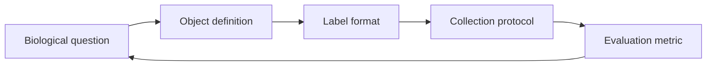

Annotation quality is not how pretty the masks look in a figure. It is whether the label **matches the biological question, the protocol, and the evaluation**—simultaneously.

Definition

Annotation quality

The degree of alignment between what a label asserts about an image and what the downstream task, biology, and evaluation protocol require. High quality is not the same as high density—a sparse center point can be higher quality than a dense mask drawn under the wrong object definition.

## The basic idea

Models learn annotation conventions as if they were facts. Brush width, edge placement on ambiguous nuclei, which cells count as "positive," and whether overlapping objects are split or merged—all become part of the task.

The label format is a hypothesis about what information is sufficient—not a neutral input.

<aside class="callout callout--key-idea" role="note">

Key idea

Annotation quality is the match between label, task, biology, and evaluation—not visual neatness or label count per image.

</aside>

## Why it matters in pathology

Pathologists, annotators, and model developers may use the same word ("nucleus," "tumor," "artifact") with different visual criteria. Without a written protocol, inter-rater disagreement becomes training noise the model overfits.

This connects directly to [center points vs. segmentation masks](/blog/small-explainers/center-points-vs-segmentation-masks) and [morphology before accuracy](/blog/research-notes/morphology-before-accuracy): label resolution and label relevance are different questions.

<aside class="callout callout--observation" role="note">

Observation

Two models with identical Dice scores can encode different scientific objects if one was trained on SAM-assisted masks and the other on pathologist SOP masks—same metric, different tasks.

</aside>

Promptable tools like [Segment Anything](/blog/paper-notes/segment-anything-promptability-changes-annotation-but-not-responsibility) change throughput. They do not remove the obligation to define the object.

## The common mistake

Equating quality with quantity:

- more labels ≠ more informative labels
- cleaner edges ≠ correct edges for the task
- higher agreement among annotators ≠ agreement with the clinical guideline

Definition

Protocol alignment

A label is protocol-aligned when a trained annotator following the written SOP would produce the same decision on ambiguous cases as the labels used for training—measured by adjudicated review, not by assumption.

<aside class="callout callout--misconception" role="note">

Common misconception

Model errors are always architecture problems. Many "model failures" are label definition drift between training and deployment.

</aside>

## How I use it

Before training, I document:

1. **Object definition** (inclusion/exclusion rules)
2. **Ambiguity policy** (skip, best guess, dual label)
3. **Tool effects** (brush size, SAM prompts, magnification)
4. **Gold subset** for ongoing agreement monitoring

See [why pixel-perfect labels aren't always necessary](/blog/research-notes/why-pixel-perfect-labels-arent-always-necessary) for when sparse labels are higher quality than dense wrong ones.

## A practical check

Could two teams agree your dataset has "high-quality annotations" and still build incompatible models? If yes, your quality claim is underspecified. Publish the protocol, not only the count.

## Research question for my own work

**If annotation quality failed silently—labels look good but mean the wrong thing—what symptom would appear only at deployment?**

Diagnostic test: hold out a adjudicated gold set where senior pathologists resolve ambiguous cases independently of training labels. Train to convergence on standard labels; evaluate on gold. A large gap between training-validation performance and gold performance is annotation misalignment—not "distribution shift" by default.

Annotation quality is the contract between biology and loss function. Break the contract early, pay at evaluation.
