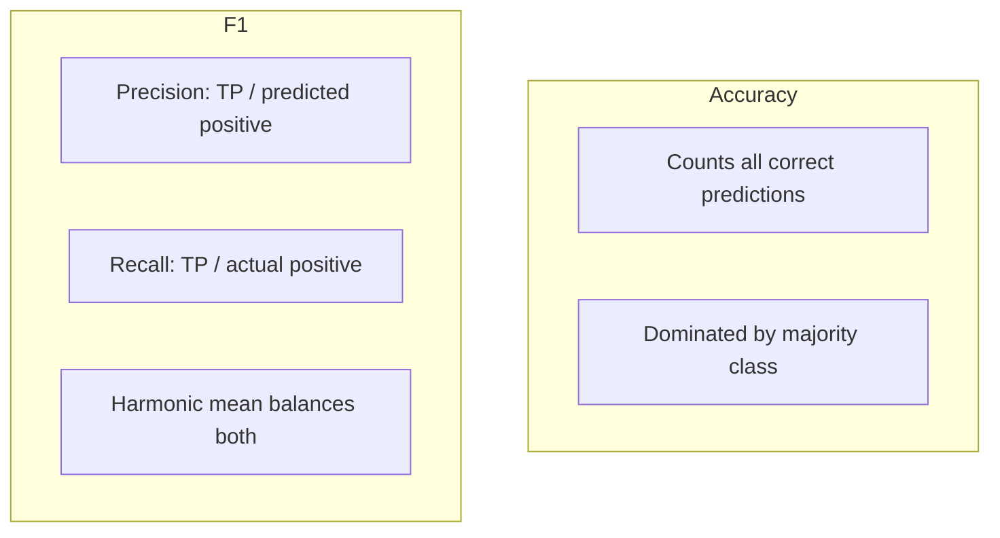

F1 is one of those metrics that becomes less clear the more casually it is used. The simple formula is easy; the harder part is knowing **when it answers your question and when it hides a worse failure than accuracy would.**

Definition

F1 score

The harmonic mean of precision and recall for a chosen positive class: F1 = 2 · (precision · recall) / (precision + recall). It treats false positives and false negatives as equally costly in the balance—unlike accuracy, which counts true negatives equally with true positives.

In my notes, I explain metrics by asking three questions: what failure matters, what assumption the metric makes, and what mistake becomes easier to miss?

## The basic idea

**Accuracy** measures the fraction of all predictions that are correct. When negatives dominate—as in rare tumor foci, sporulation events, or artifact classes—a model that never predicts the positive class can still achieve high accuracy.

**F1** focuses on the positive class only. It asks: of the cases you called positive, how many were right (precision)? Of the true positives, how many did you find (recall)? The harmonic mean punishes extremes: you cannot maximize F1 with great precision and terrible recall, or vice versa.

Choosing the positive class is not neutral. It encodes which errors you care about first.

<aside class="callout callout--key-idea" role="note">

Key idea

F1 is better than accuracy when the positive class is rare <em>and</em> both missed positives and false alarms matter—not when you only care about one side of that tradeoff.

</aside>

## Why it matters in pathology

Imbalance is routine: metastasis in lymph nodes, mitotic figures, specific immune cell subsets, QC artifact classes. A slide-level model evaluated only on accuracy can look deployment-ready while never detecting the condition that motivated screening.

In nucleus analysis, I ask what the model must get right—not only whether it "classifies" correctly. See [what makes histopathology challenging](/blog/small-explainers/what-makes-histopathology-challenging) and [why evaluation matters more than another 1% accuracy](/blog/research-notes/why-evaluation-matters-more-than-another-1-accuracy).

<aside class="callout callout--observation" role="note">

Observation

Two models with F1 = 0.80 can differ sharply: one misses rare positives entirely at high precision; another finds them but floods pathologists with false alarms. F1 matches; clinical burden does not.

</aside>

## The common mistake

Treating F1 as the automatic metric for "imbalanced data" without specifying:

- **which class is positive** (tumor vs. normal? artifact vs. tissue?)
- **which threshold** produces the reported F1 (default 0.5 is often wrong)
- **whether false negatives and false positives have asymmetric cost**

Definition

Precision and recall

<strong>Precision</strong> = TP / (TP + FP): purity of positive calls. <strong>Recall</strong> = TP / (TP + FN): coverage of true positives. F1 forces a compromise; clinical workflows may not want compromise—they may want high recall at bounded precision, or the reverse.

<aside class="callout callout--misconception" role="note">

Common misconception

High F1 means the model is clinically safe. It means the model balances two chosen errors at one threshold on one dataset split.

</aside>

## How I use it

I pair F1 with:

- **PR curves** when positives are rare (ROC can look optimistic)
- **stratified reporting** by site, scanner, stain—see [clinical-grade weak supervision](/blog/paper-notes/clinical-grade-weak-supervision-real-data-is-not-a-footnote)
- **qualitative error review** tied to [annotation quality](/blog/small-explainers/why-annotation-quality-matters)

If recall at fixed precision (or precision at fixed recall) matches the clinical question better, I report that instead of F1 alone.

## A practical check

Could two people agree the model reports F1 = 0.85 and still disagree whether it solved the problem? If yes, specify:

1. positive class definition
2. threshold selection protocol
3. prevalence in eval set vs. deployment
4. cost asymmetry (missed cancer vs. unnecessary review)

## Research question for my own work

**Does F1 at the reported threshold reflect the failure mode my pathologist collaborators actually fear?**

Diagnostic test: pick 50 false negatives and 50 false positives from the operating point that maximizes F1. Review with a domain expert. If one error type is clinically unacceptable and the other tolerable, F1 is the wrong scalar—optimize the constrained metric (e.g., recall ≥ 0.95 at maximum precision) and report the tradeoff curve.

F1 is better than accuracy when rarity makes negatives dominate the story. It is not better than thinking clearly about which mistakes matter.
